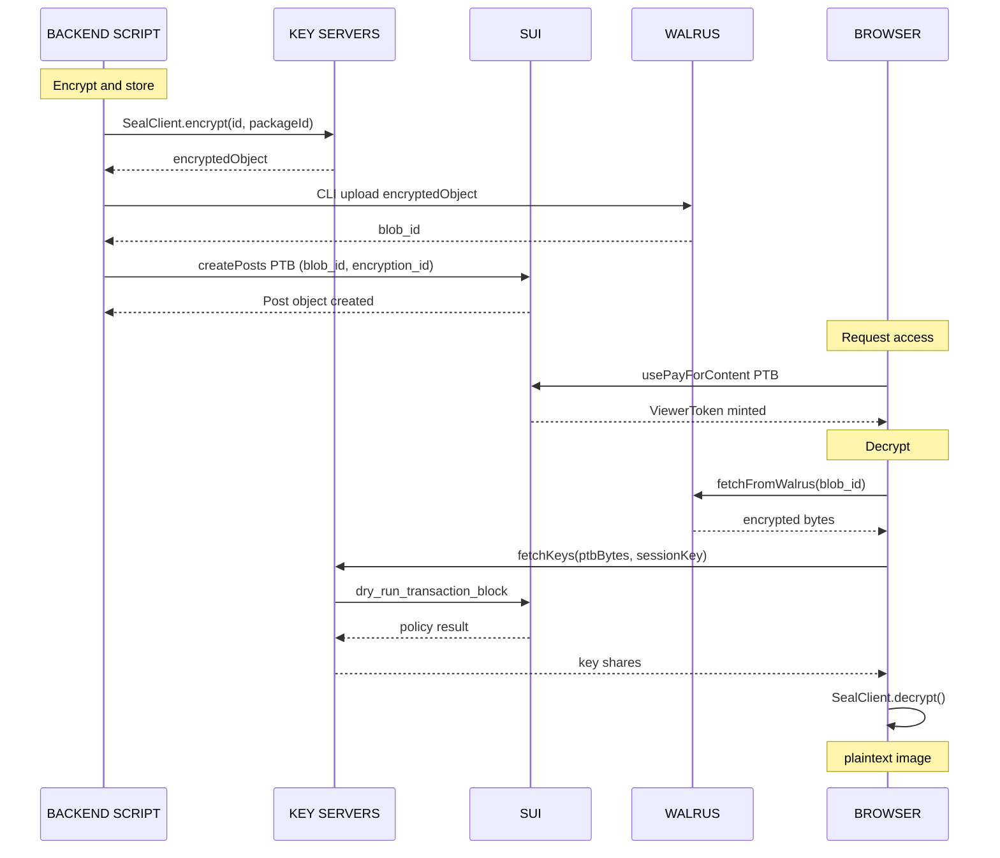

# Seal: Decentralized Secrets Management

Seal is a decentralized secrets management (DSM) service built on Sui that provides threshold encryption with onchain access control. You define who can decrypt in Move, and Seal key servers enforce those policies before releasing decryption keys.

## Architecture

Seal has 3 core components:

### 1. Onchain Access Policies

Move `entry fun` functions in your package that define who is allowed to decrypt. Key servers evaluate your policy by running `dry_run_transaction_block` on Sui when a user requests decryption key shares. If the policy approves (doesn't abort), the servers return the key shares.

### 2. Key Servers

Offchain services that hold IBE master secret keys. Each server returns derived decryption key shares only when the request satisfies the associated onchain policy. You configure a threshold `t` out of `n` servers — decryption requires at least `t` servers to agree.

Key server object IDs live onchain as `KeyServer` objects that always hold the latest URL. See the [Seal documentation](https://seal-docs.wal.app/Pricing) for the full list of verified key servers and their modes (open vs. permissioned).

### 3. Client-Side Encryption/Decryption

Data is encrypted and decrypted entirely on the client. Key servers never see plaintext. The encryption is identity-based (IBE): data is encrypted to a specific identity composed of `package_id + id`.

## Identity Model

- **Identity** = `package_id` + `id` (Seal prepends the package ID automatically)
- The `id` is a `vector<u8>` you provide at encryption time
- The same `id` must be used in the `seal_approve` PTB at decryption time
- This creates a namespaced identity scoped to your package

## The `seal_approve` Convention

Your Seal-integrated Move module must expose at least one `entry fun seal_approve*` function. Key servers call this function through `dry_run_transaction_block` to determine whether to issue key shares.

**Rules:**

1. Must be an `entry fun`, not a public function
2. First parameter must always be `id: vector<u8>` — the inner identity
3. Should abort with a meaningful error code if access is denied
4. Must not be called from other PTB commands during Seal evaluation — only `seal_approve*` functions are invoked directly

**Evaluation logic:** If the function aborts → access denied. If it completes successfully → access granted.

### Basic template

```move
module your_package::content {
    // Minimal: id is first param, abort on failure
    entry fun seal_approve(id: vector<u8>, ctx: &TxContext) {
        // Your access logic here
        // Abort to deny; complete to grant
    }
}
```

## Access Control Patterns

### Owner-Only Access

The most basic policy: only the wallet address encoded in the identity can decrypt.

```move
module example::private_seal {
    use sui::bcs;
    use sui::tx_context::TxContext;

    entry fun seal_approve(
        id: vector<u8>,
        _ctx: &TxContext,
    ) {
        let caller_bytes = bcs::to_bytes(&tx_context::sender(ctx));
        assert!(id == caller_bytes, 0);
    }
}
```

The client BCS-encodes the caller's address as the identity at encryption time. Only that address can later decrypt.

### Time-Lock Access

Users can only decrypt after a specific timestamp. The `id` encodes a `u64` unlock time in milliseconds.

```move
module example::timelock_seal {
    use sui::bcs;
    use sui::clock::Clock;
    use sui::tx_context::TxContext;

    entry fun seal_approve(
        id: vector<u8>,
        clock: &Clock,
        _ctx: &TxContext,
    ) {
        let unlock_time_ms: u64 = bcs::peel_u64(&mut bcs::new(id));
        let current_timestamp_ms = clock::timestamp_ms(clock);
        assert!(current_timestamp_ms >= unlock_time_ms, 0);
    }
}
```

### Allowlist Access

A shared `Allowlist` object holds authorized addresses. Admins can add/remove members without re-encrypting content.

```move
module example::allowlist_seal {
    use sui::vec_set::{Self, VecSet};
    use sui::tx_context::{sender, TxContext};

    public struct Allowlist has key {
        id: UID,
        members: VecSet<address>,
    }

    entry fun seal_approve(
        id: vector<u8>,
        allowlist: &Allowlist,
        ctx: &TxContext,
    ) {
        assert!(vec_set::contains(&allowlist.members, &sender(ctx)), 0);
    }

    // Admin functions to manage members
    entry fun add_member(allowlist: &mut Allowlist, member: address, _ctx: &TxContext) {
        vec_set::insert(&mut allowlist.members, member);
    }

    entry fun remove_member(allowlist: &mut Allowlist, member: address, _ctx: &TxContext) {
        vec_set::remove(&mut allowlist.members, &member);
    }
}
```

### ViewerToken Gating (OnlyFins Pattern)

The user must own a `ViewerToken` object for a specific post. The `ViewerToken` is a Sui object minted onchain when the user purchases access.

```move
module onlyfins::posts {
    use sui::tx_context::TxContext;

    public struct ViewerToken has key, store {
        id: UID,
        post_id: ID,
    }

    public struct Post has key {
        id: UID,
        blob_id: u256,
        encryption_id: vector<u8>,
    }

    entry fun seal_approve_access(
        id: vector<u8>,
        post: &Post,
        viewer_token: &ViewerToken,
        _ctx: &TxContext,
    ) {
        assert!(object::id(post) == viewer_token.post_id, 0);
        assert!(id == post.encryption_id, 1);
    }
}
```

## Encrypt-Upload-Decrypt Sequence



## How Seal Fits with Walrus

Walrus stores all blobs publicly. Seal provides the encryption layer on top:

1. Encrypt data locally with Seal before upload
2. Store the encrypted blob on Walrus; blob ID stored on a Sui object
3. To access, build a transaction proving authorization
4. Seal key servers verify the transaction against the onchain policy, return key shares
5. User combines key shares, derives the decryption key, decrypts locally

The blob on Walrus is always public. What is secret is the encryption key — access to it is controlled entirely by the onchain policy.

## Tooling

### Seal CLI

The `seal-cli` is for local testing: encrypt, decrypt, generate key pairs, inspect encrypted objects, and fetch keys. Useful for verifying Move policy and testing key server connectivity before SDK integration.

See: [Seal CLI documentation](https://seal-docs.wal.app/SealCLI)

### TypeScript SDK

```bash
npm install @mysten/seal @mysten/sui
```

Two primary classes:

- **`SealClient`**: Encryption, key fetching, and decryption. Can be instantiated standalone or as a Sui client extension.
- **`SessionKey`**: User-approved session that allows fetching decryption keys without wallet popups per request. Has a TTL, scoped to a specific package ID.

## Security Warning

Seal should NOT be used to protect highly sensitive data such as wallet keys, personal health information, or government-level secrets. Review the [Seal Terms of Service](https://seal-docs.wal.app/TermsOfService) and [security best practices](https://seal-docs.wal.app/).

## Transport Recommendation

Use `SuiGrpcClient` from `@mysten/sui/grpc` — this is the recommended transport. Some older examples use `SuiClient` or the deprecated `SuiJsonRpcClient`. All `SealClient` constructor and encrypt/decrypt APIs are identical regardless of transport.

```typescript
import { SuiGrpcClient } from '@mysten/sui/grpc';
import { SealClient } from '@mysten/seal';

const suiClient = new SuiGrpcClient({
    baseUrl: 'https://fullnode.testnet.sui.io:443',
    network: 'testnet',
});

const sealClient = new SealClient({
    suiClient,
    serverObjectIds: [/* KeyServer object IDs */],
    verifyKeyServers: true,
});
```
