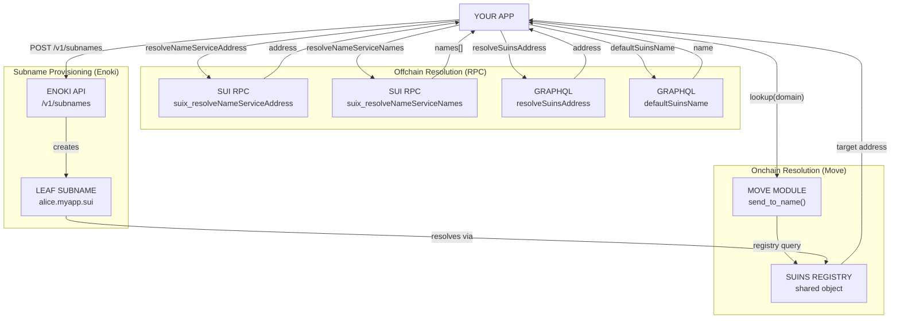

# Domain Names with SuiNS — Integration Guide

End-to-end guide for integrating Sui Name Service (SuiNS) into your app: onchain resolution in Move, offchain resolution through RPC and GraphQL, reverse lookup, subnames, and the Enoki subname API. Uses [Sui Messenger](https://github.com/MystenLabs/messaging-sdk-example) as a concrete reference implementation throughout.

> Source constraint: Information sourced from [docs.sui.io/sui-stack/suins](https://docs.sui.io/sui-stack/suins), [docs.suins.io/developer](https://docs.suins.io/developer), and [Enoki subname docs](https://docs.enoki.mystenlabs.com/subnames).

## Prerequisites

- Sui CLI installed ([suiup](https://docs.sui.io/getting-started/onboarding/sui-install))
- Node.js 18+ with `@mysten/sui` (`pnpm add @mysten/sui`)
- A deployed Sui Move package (for onchain resolution)
- A SuiNS domain (register at [suins.io](https://suins.io/))
- An [Enoki API key](https://portal.enoki.mystenlabs.com) (for Enoki subname API)

## Introduction to SuiNS

Sui Name Service maps human-readable `.sui` names to wallet addresses. Replace `0xfe9c7a...` with `alice.sui` in your UI, send assets to names, or create app-specific subnames under domains you control.

### Resolution Architecture



## Onchain Resolution (Move)

### Step 1: Add Dependency

**Mainnet:**
```toml
[dependencies]
suins = { git = "https://github.com/MystenLabs/suins-contracts/", subdir = "packages/suins", rev = "releases/mainnet/core/v3" }
```

**Testnet:**
```toml
[dependencies]
suins = { git = "https://github.com/MystenLabs/suins-contracts/", subdir = "packages/suins", rev = "releases/testnet/core/v2" }
```

> **Warning:** Use the core package only. Utility packages are subject to replacement and may break your logic.

### Step 2: Implement Name Resolution in Move

```move
module demo::suins_demo {
    use std::string::String;
    use sui::clock::Clock;
    use suins::{
        suins::SuiNS,
        registry::Registry,
        domain
    };

    const ENameNotFound: u64 = 0;
    const ENameNotPointingToAddress: u64 = 1;
    const ENameExpired: u64 = 2;

    /// Transfer any object to a SuiNS name.
    public fun send_to_name<T: key + store>(
        suins: &SuiNS,
        obj: T,
        name: String,
        clock: &Clock
    ) {
        // Step 1: Convert string to Domain and lookup in registry
        let mut optional = suins.registry<Registry>().lookup(domain::new(name));

        // Step 2: Verify the name exists
        assert!(optional.is_some(), ENameNotFound);
        let name_record = optional.extract();

        // Step 3: Verify the name has not expired
        assert!(!name_record.has_expired(clock), ENameExpired);

        // Step 4: Verify a target address is set
        assert!(name_record.target_address().is_some(), ENameNotPointingToAddress);

        // Step 5: Transfer the object to the resolved address
        transfer::public_transfer(obj, name_record.target_address().extract())
    }

    /// Lookup-only: resolves a name to its target address without transferring.
    /// Returns address(0x0) if the name does not exist, has expired, or has no target.
    public fun resolve_name(
        suins: &SuiNS,
        name: String,
        clock: &Clock
    ): address {
        let mut optional = suins.registry<Registry>().lookup(domain::new(name));
        if (optional.is_none()) {
            return @0x0
        };
        let name_record = optional.extract();
        if (name_record.has_expired(clock)) {
            return @0x0
        };
        if (name_record.target_address().is_none()) {
            return @0x0
        };
        name_record.target_address().extract()
    }
}
```

### Error Constants Explained

| Constant | Value | When It Triggers | Production Scenario |
|----------|-------|------------------|---------------------|
| `ENameNotFound` | `0` | `lookup()` returns `None` — name does not exist in registry | Name never registered, or expired and released. Check [suins.io](https://suins.io/). |
| `ENameExpired` | `1` | `has_expired(clock)` returns `true` | Storage epoch passed. Holder must renew before name resolves again. |
| `ENameNotPointingToAddress` | `2` | `target_address()` returns `None` | Name record exists and is not expired, but holder has not set a target address. |

### SuiNS Shared Object Reference

The `SuiNS` shared object must be passed to any function performing onchain resolution. Object IDs:

| Network | SuiNS Core Object ID |
|---------|---------------------|
| Mainnet | `0x6e0ddefc0ad98889c04bab9639e512c21766c5e6366f89e696956d9be6952871` |
| Testnet | `0x300369e8909b9a6464da265b9a5a9ab6fe2158a040e84e808628cde7a07ee5a3` |

> Always verify against [docs.suins.io/developer](https://docs.suins.io/developer) for the latest constants.

## Offchain Resolution (TypeScript)

### Lookup: Name → Address

#### JSON-RPC

```ts
import { SuiClient, getFullnodeUrl } from '@mysten/sui/client';

const client = new SuiClient({ url: getFullnodeUrl('mainnet') });

async function lookupName(name: string): Promise<string | null> {
  const address = await client.resolveNameServiceAddress({ name });
  return address;
}

// Usage
const addr = await lookupName('example.sui');
if (addr) {
  console.log(`example.sui → ${addr}`);
} else {
  console.log('Name not found or expired');
}
```

#### GraphQL

```ts
async function lookupNameGraphQL(name: string): Promise<string | null> {
  const query = `
    query($name: String!) {
      resolveSuinsAddress(domain: $name) {
        address
      }
    }
  `;
  const res = await fetch('https://sui-mainnet.mystenlabs.com/graphql', {
    method: 'POST',
    headers: { 'Content-Type': 'application/json' },
    body: JSON.stringify({ query, variables: { name } }),
  });
  const { data } = await res.json();
  return data?.resolveSuinsAddress?.address ?? null;
}
```

### Reverse Lookup: Address → Default Name

#### JSON-RPC

```ts
async function reverseLookup(address: string): Promise<string | null> {
  const { data } = await client.resolveNameServiceNames({ address });
  return data?.[0] ?? null;
}

// Usage
const name = await reverseLookup('0x2');
console.log(`0x2 → ${name}`); // "0x2 → example.sui"
```

#### GraphQL

```ts
async function reverseLookupGraphQL(address: string): Promise<string | null> {
  const query = `
    query($address: SuiAddress!) {
      address(address: $address) {
        defaultSuinsName: defaultNameRecord {
          name
        }
      }
    }
  `;
  const res = await fetch('https://sui-mainnet.mystenlabs.com/graphql', {
    method: 'POST',
    headers: { 'Content-Type': 'application/json' },
    body: JSON.stringify({ query, variables: { address } }),
  });
  const { data } = await res.json();
  return data?.address?.defaultSuinsName?.name ?? null;
}
```

### useUserSubname Hook (Sui Messenger Pattern)

Sui Messenger resolves subnames for connected wallets via the Enoki API rather than querying the SuiNS registry directly, since subnames under `sui-stack.sui` are provisioned programmatically through Enoki:

```ts
import { useQuery } from '@tanstack/react-query';
import { useCurrentWallet } from '@mysten/dapp-kit';

export function useUserSubname(domain: string, enokiApiKey: string) {
  const { currentWallet } = useCurrentWallet();
  const address = currentWallet?.accounts?.[0]?.address;

  return useQuery({
    queryKey: ['suins-subname', address, domain],
    queryFn: async () => {
      if (!address) return null;

      const params = new URLSearchParams({
        network: 'mainnet',
        address,
        domain,
      });
      const res = await fetch(
        `https://api.enoki.mystenlabs.com/v1/subnames?${params}`,
        { headers: { Authorization: `Bearer ${enokiApiKey}` } }
      );
      const data = await res.json();
      return data.subnames?.[0]?.name ?? null;
    },
    enabled: !!address,
    staleTime: 5 * 60 * 1000, // 5 minutes
  });
}

// Usage in component
function ProfileHeader() {
  const { data: subname, isLoading } = useUserSubname('sui-stack.sui', ENOKI_API_KEY);
  return <div>{isLoading ? '...' : subname ?? 'Anonymous'}</div>;
}
```

## Enoki Subname API

The Enoki subname API provisions subnames programmatically. Enoki holds your domain in a managed contract and handles creation, deletion, and renewal.

### Prerequisites

1. **Own a SuiNS domain** on the target network
2. **Link domain** in [Enoki Portal](https://portal.enoki.mystenlabs.com) → Subnames section → Link a Domain
3. **Publish domain** to make it `LIVE` (required for API calls)
4. **Create an API key** with the `SUBNAMES` feature enabled

### Domain Transfer

When you link a domain, it's transferred to an Enoki-managed contract. Enoki can only borrow the domain (register/delete a subname) and must return it. You can reclaim your domain at any time through the Enoki Portal.

### Public API Key + zkLogin (User-Facing)

Each user gets at most **1 subname per domain**. The zkLogin JWT auto-associates the subname with the user's address:

```ts
async function createUserSubname(
  publicApiKey: string,
  userJwt: string,
  domain: string,
  subname: string,
  network: 'mainnet' | 'testnet' = 'mainnet'
) {
  const res = await fetch('https://api.enoki.mystenlabs.com/v1/subnames', {
    method: 'POST',
    headers: {
      'Authorization': `Bearer ${publicApiKey}`,
      'zklogin-jwt': userJwt,
      'Content-Type': 'application/json',
    },
    body: JSON.stringify({ domain, network, subname }),
  });

  if (!res.ok) {
    const err = await res.json();
    throw new Error(`Enoki subname creation failed: ${err.message}`);
  }

  const data = await res.json();
  // { name: 'alice@myapp.sui', status: 'PENDING', createdAt: '...' }

  // Poll until ACTIVE
  return pollSubnameStatus(publicApiKey, domain, network, data.name);
}

async function pollSubnameStatus(
  apiKey: string,
  domain: string,
  network: string,
  subnameName: string,
  maxRetries = 10,
  intervalMs = 1000
): Promise<string> {
  for (let i = 0; i < maxRetries; i++) {
    await new Promise((r) => setTimeout(r, intervalMs));

    const params = new URLSearchParams({ network, domain });
    const res = await fetch(
      `https://api.enoki.mystenlabs.com/v1/subnames?${params}`,
      { headers: { Authorization: `Bearer ${apiKey}` } }
    );
    const { subnames } = await res.json();

    const sub = subnames?.find((s: { name: string }) => s.name === subnameName);
    if (sub?.status === 'ACTIVE') return sub.name;
  }
  throw new Error(`Subname ${subnameName} did not become ACTIVE within timeout`);
}
```

### Private API Key (Backend)

Use for specifying arbitrary target addresses or creating multiple subnames per user:

```ts
async function createSubnamePrivate(
  privateApiKey: string,
  domain: string,
  subname: string,
  targetAddress: string,
  network: 'mainnet' | 'testnet' = 'mainnet'
) {
  const res = await fetch('https://api.enoki.mystenlabs.com/v1/subnames', {
    method: 'POST',
    headers: {
      'Authorization': `Bearer ${privateApiKey}`,
      'Content-Type': 'application/json',
    },
    body: JSON.stringify({ domain, network, subname, targetAddress }),
  });
  return res.json();
}
```

### Query Subnames

```ts
async function getSubnamesForAddress(
  apiKey: string,
  address: string,
  domain: string,
  network: 'mainnet' | 'testnet' = 'mainnet'
) {
  const params = new URLSearchParams({ network, address, domain });
  const res = await fetch(
    `https://api.enoki.mystenlabs.com/v1/subnames?${params}`,
    { headers: { Authorization: `Bearer ${apiKey}` } }
  );
  const data = await res.json();
  // { subnames: [{ name: 'alice@myapp.sui', status: 'ACTIVE', createdAt: '...' }] }
  return data.subnames ?? [];
}
```

### Delete Subname (Private Key Required)

```ts
async function deleteSubname(
  privateApiKey: string,
  domain: string,
  subname: string,
  network: 'mainnet' | 'testnet' = 'mainnet'
) {
  const res = await fetch('https://api.enoki.mystenlabs.com/v1/subnames', {
    method: 'DELETE',
    headers: {
      'Authorization': `Bearer ${privateApiKey}`,
      'Content-Type': 'application/json',
    },
    body: JSON.stringify({ domain, network, subname }),
  });
  return res.ok;
}
```

### Enoki vs SuiNS SDK Decision Matrix

| Requirement | Use Enoki Subname API | Use SuiNS SDK / RPC |
|-------------|----------------------|---------------------|
| Auto-provision subnames on first login | Yes | No |
| App controls subnames (not users) | Yes | No |
| Users authenticate with zkLogin | Yes (built-in) | Manual |
| Users register & own their names | No | Yes |
| Query/resolve existing domain names | No | Yes |
| Run a self-hosted bulk indexer | No | Yes (suins-indexer) |
| Multiple subnames per user | Private key only | Yes |
| Arbitrary target addresses | Private key only | Yes |

## SuiNS SDK (@mysten/suins)

For higher-level TypeScript operations, the SuiNS SDK wraps the RPC endpoints and provides transaction builders.

### Install & Initialize

```bash
npm install @mysten/suins
```

```ts
import { SuinsClient } from '@mysten/suins';
import { SuiClient, getFullnodeUrl } from '@mysten/sui/client';

const client = new SuiClient({ url: getFullnodeUrl('testnet') });
const suinsClient = new SuinsClient({ client, network: 'testnet' });

// Single instance pattern (React context):
// export const SuinsContext = createContext<SuinsClient | null>(null);
// <SuinsContext.Provider value={suinsClient}>{children}</SuinsContext.Provider>
```

> Keep `@mysten/suins` updated. Stale constants cause transaction build failures.

### Full SDK Documentation

See [docs.suins.io/developer/sdk](https://docs.suins.io/developer/sdk) for the complete API: name registration, renewal, transfer, setting target/default addresses, and more.

## Indexing with suins-indexer

For queries beyond single name/address lookups, run your own instance of the [`suins-indexer`](https://github.com/MystenLabs/sui/tree/main/crates/suins-indexer).

```bash
# Clone and build the indexer
git clone https://github.com/MystenLabs/sui.git
cd sui/crates/suins-indexer
cargo build --release

# Run with your configuration
./target/release/suins-indexer --config-path ./config.toml
```

See [custom indexer documentation](https://docs.sui.io/develop/accessing-data/custom-indexer) for full setup.

Useful queries via the indexer:

- Get all subnames under a parent domain
- Get all domain names pointing to a given wallet address
- Bulk domain state queries not feasible via single RPC calls

## Subnames

Subnames are nested names under a parent. Creating subnames has **no cost**. Maximum nesting depth is **8 levels** (10 total including SLD + TLD).

### Subname Types

| Capability | Node Subnames | Leaf Subnames |
|------------|--------------|---------------|
| **Has NFT** | Yes (`SubDomainRegistration`) | No — parent NFT acts as capability |
| **Can create children** | Yes, if parent allows | No |
| **Expiration** | Yes — parent-determined or extendable | No — tied to parent |
| **Target address** | NFT holder can set; can be empty | Active parent holder can set; cannot be empty |
| **Reverse registry** | Yes | Yes |
| **Transfer ownership** | Yes (via NFT) | No |
| **Revoke** | No (except post-expiration) | Yes — parent holder can revoke at any time |
| **Burn** | Post-expiration only | Yes (same as revoke) |

### When to Use Each Type

- **Node subnames:** Use when subnames need independent ownership, transfers, or the ability to create their own children. Similar to regular SuiNS names with full NFT features.
- **Leaf subnames:** Use for programmatic, app-controlled identities (like Sui Messenger's user subnames under `sui-stack.sui`). No NFT overhead, revocable by parent, simple lifecycle.

### Nesting Rules

- Parent rules control whether children (node or leaf) can be created under a node subname.
- Parent rules can allow a subname to extend its expiration to match the parent's.
- Maximum total depth: 10 levels (SLD + TLD + 8 subname levels).
- Example valid nesting: `charlie.bob.alice.myapp.sui` (3 subname levels under `myapp.sui`).

## Failure Modes Reference

| Error | Cause | Resolution |
|-------|-------|------------|
| Name not found (`null` / `ENameNotFound` · `0`) | Not registered, or expired and released | Check at [suins.io](https://suins.io/); renew if expired |
| Target address not set (`ENameNotPointingToAddress` · `2`) | Holder has not set a target address | Holder must call set-target-address in SuiNS portal |
| Name expired (`ENameExpired` · `1`) | Storage epoch passed; name still in registry but resolves as expired | Holder must renew at [suins.io](https://suins.io/) |
| Wrong network | Mainnet name queried on Testnet client (or vice versa) | Match `SuiClient` URL to name's network |
| Enoki: domain not `LIVE` | Domain linked but not published in Enoki Portal | Publish the domain in Enoki Portal |
| Enoki: subname not resolving | Asynchronous creation — status is `PENDING` | Poll `GET /v1/subnames` until status is `ACTIVE` |
| Domain expired, subnames stop resolving | SuiNS domain past expiry or grace period | Renew domain before 30-day grace period ends |

## Troubleshooting

### 1. Name Not Found

**Symptom:** `lookup` returns `null` or Move `ENameNotFound` aborts.

**Checklist:**
- Verify name exists at [suins.io](https://suins.io/)
- Check spelling and TLD (`.sui`)
- Expired names return `null` even if previously registered
- Wrong network? Mainnet vs Testnet clients are separate

```ts
// Defensive lookup pattern
async function safeLookup(name: string): Promise<string | null> {
  try {
    const address = await client.resolveNameServiceAddress({ name });
    if (!address) {
      console.warn(`Name "${name}" not found or expired`);
      // Check suins.io to see if it exists
    }
    return address;
  } catch (err) {
    console.error(`Lookup failed: ${err}`);
    return null;
  }
}
```

### 2. Target Address Not Set

**Symptom:** `target_address()` returns `None` in Move, but name exists and is not expired.

**Resolution:** The NFT holder must set a target address. Treat `None` as unresolvable in your UI and instruct the user to set a target address through the SuiNS portal.

```move
// Safe extraction pattern
if (name_record.target_address().is_none()) {
    // Handle gracefully — do not abort
    abort ENameNotPointingToAddress  // or return default/fallback
};
```

### 3. Wrong Network

**Symptom:** `resolveNameServiceAddress` returns `null` on Mainnet for a name you just registered on Testnet.

**Resolution:** Confirm `SuiClient` constructor URL matches the network:
```ts
// Testnet
new SuiClient({ url: getFullnodeUrl('testnet') })
// Mainnet
new SuiClient({ url: getFullnodeUrl('mainnet') })
```

### 4. Enoki Subname Creation Fails

**Symptom:** POST returns an error.

**Checklist:**
- Domain must be in `LIVE` status in Enoki Portal
- With public key + zkLogin: each user can only have 1 subname per domain
- Verify API key has `SUBNAMES` feature enabled
- Domain must be registered on the correct network

```ts
// Defensive creation with error handling
async function safeEnokiCreate(
  apiKey: string,
  jwt: string,
  domain: string,
  subname: string,
  network: string
): Promise<{ name: string; status: string } | null> {
  const res = await fetch('https://api.enoki.mystenlabs.com/v1/subnames', {
    method: 'POST',
    headers: {
      'Authorization': `Bearer ${apiKey}`,
      'zklogin-jwt': jwt,
      'Content-Type': 'application/json',
    },
    body: JSON.stringify({ domain, network, subname }),
  });

  if (!res.ok) {
    const error = await res.json();
    if (error.message?.includes('already has a subname')) {
      // User already has a subname — fetch existing
      return getExistingSubname(apiKey, domain, network);
    }
    throw new Error(`Enoki error: ${error.message}`);
  }
  return res.json();
}
```

### 5. Subname Not Resolving After Creation

**Symptom:** POST succeeded but `resolveNameServiceAddress` returns `null`.

**Cause:** Enoki creation is asynchronous. Subnames spend a few seconds in `PENDING` status before becoming `ACTIVE`.

```ts
// Polling helper
async function waitForActive(
  apiKey: string,
  domain: string,
  expectedName: string,
  network: string,
  timeoutMs = 15000
): Promise<void> {
  const start = Date.now();
  while (Date.now() - start < timeoutMs) {
    const params = new URLSearchParams({ network, domain });
    const res = await fetch(
      `https://api.enoki.mystenlabs.com/v1/subnames?${params}`,
      { headers: { Authorization: `Bearer ${apiKey}` } }
    );
    const { subnames } = await res.json();
    const sub = subnames?.find((s: { name: string }) => s.name === expectedName);
    if (sub?.status === 'ACTIVE') return;
    await new Promise((r) => setTimeout(r, 1000));
  }
  throw new Error(`Subname ${expectedName} did not become ACTIVE within ${timeoutMs}ms`);
}
```

### 6. Domain Expired — Subnames Blocked

**Symptom:** Enoki cannot create or delete subnames, existing subnames stop resolving.

**Resolution:** Renew domain at [suins.io](https://suins.io/) before the 30-day grace period ends. After the grace period, the domain becomes available for anyone to register and you lose ownership permanently.

**Enoki auto-renewal:** Enable in Enoki Portal to automatically renew domains ~30 days before expiration. Applies to both mainnet and testnet domains. On mainnet, renewal fees are charged to your Enoki billing account.

## Resources

- [SuiNS Developer Docs](https://docs.suins.io/developer) — Full API, active constants, transaction patterns
- [SuiNS SDK Docs](https://docs.suins.io/developer/sdk) — TypeScript SDK reference
- [SuiNS Contracts](https://github.com/MystenLabs/suins-contracts/) — Move source code
- [Enoki Subname API](https://docs.enoki.mystenlabs.com/subnames) — REST API reference
- [Enoki Portal](https://portal.enoki.mystenlabs.com) — Manage domains and API keys
- [suins-indexer](https://github.com/MystenLabs/sui/tree/main/crates/suins-indexer) — Bulk query indexer
- [Sui Messenger](https://github.com/MystenLabs/messaging-sdk-example) — Reference app
- [Sui GraphQL Reference](https://docs.sui.io/references/sui-api/sui-graphql/reference) — GraphQL schema
- [Sui JSON-RPC API](https://docs.sui.io/references/sui-api) — RPC method reference
