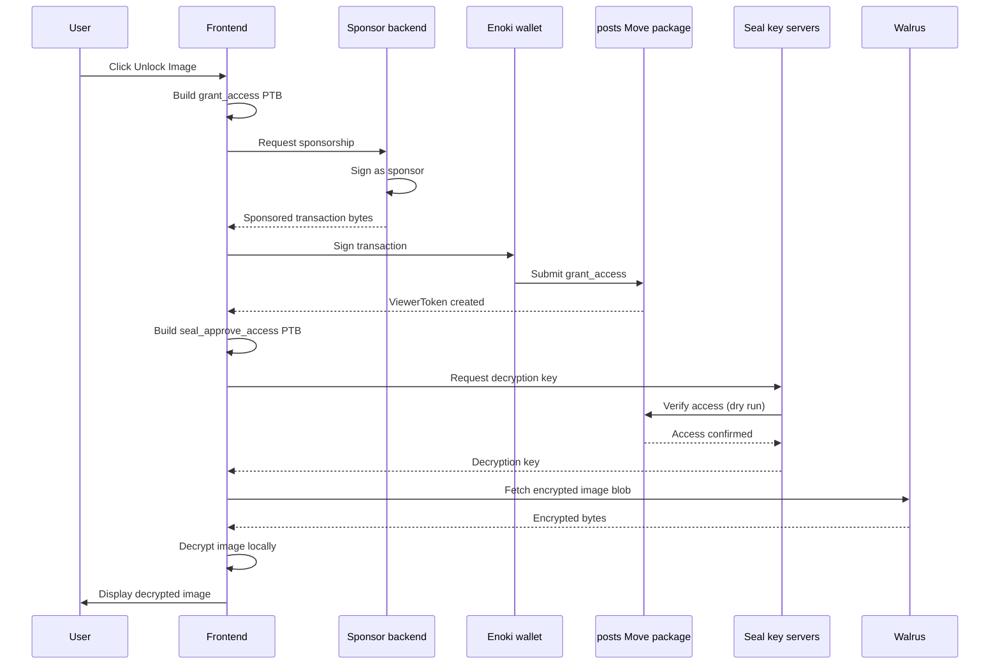

# OnlyFins — Encrypted Social Media Example

OnlyFins is a Web3 social platform demonstrating encrypted content sharing with onchain access control. Creators publish posts with images on Walrus (encrypted via Seal), and viewers purchase `ViewerToken` capability objects to decrypt content. Uses Enoki zkLogin for Google sign-in and sponsored transactions (users don't hold SUI for gas).

> Source: [Sui docs — Encrypted Social Media](https://docs.sui.io/sui-stack/walrus/only-fins), [onlyfins-example-app](https://github.com/MystenLabs/onlyfins-example-app)

## When to Use This Pattern

- Gating access to encrypted content with onchain ownership tokens
- Storing encrypted files on Walrus and controlling decryption through Seal threshold encryption
- zkLogin authentication with Google (no wallet needed initially)
- Sponsored transactions (users interact without SUI)
- Content marketplace: creators publish, viewers pay, all verifiable onchain

## What You Learn

| Concept | Implementation |
|---|---|
| **Shared objects** | Posts are shared — any user reads metadata, only authorized decrypt |
| **Capability pattern** | `ViewerToken` owned objects prove purchase of access |
| **Seal encryption** | Threshold encryption — Move contract authorizes key release |
| **Sponsored transactions** | Backend pays gas, frontend sends unsigned tx, backend co-signs |
| **Walrus storage** | Encrypted image blobs stored on Walrus, referenced by blob ID |

## Architecture

```
4 actors + 1 onchain package:

  [User] → [React Frontend] → [Sponsor Backend]
                                      ↓
                               [Enoki Wallet] (zkLogin + signing)
                                      ↓
                          [posts Move package] on Sui
                           ↙                      ↘
              [Walrus] (blobs)            [Seal] (key servers)
```



## Prerequisites

- Sui CLI installed and configured for Testnet
- Sui wallet with Testnet SUI and WAL
- Node.js 18+ with pnpm
- Google account for Enoki zkLogin login

## Setup

### 1. Clone and Install

```bash
git clone https://github.com/MystenLabs/onlyfins-example-app.git
cd onlyfins-example-app/frontend
pnpm install
```

### 2. Switch Network

```bash
sui client switch --env testnet
```

### 3. Publish Move Package

```bash
cd move/posts
sui move build
sui client publish --gas-budget 200000000
```

Record the `PackageID` from the output:
```
│ PackageID: 0x29af8b7725a4cd3ba29f7c836433ea115ade7460bc5c610d9e7580d10cd991de
```

### 4. Update Package ID

In `frontend/src/constants.ts`:
```ts
export const POSTS_PACKAGE_ID = '0x29af8b7725a4cd3ba29f7c836433ea115ade7460bc5c610d9e7580d10cd991de';
```

### 5. Configure Backend

```bash
cd ../../../backend/
cp .env.example .env
```

`.env`:
```bash
AUTHOR_1_PRIVATE_KEY=YOUR_ED25519_PRIVATE_KEY
AUTHOR_2_PRIVATE_KEY=YOUR_ED25519_PRIVATE_KEY
AUTHOR_3_PRIVATE_KEY=YOUR_ED25519_PRIVATE_KEY
PACKAGE_ID=PACKAGE_ID_FROM_STEP_3
```

Get private keys:
```bash
sui keytool export --key-identity YOUR_WALLET_ADDRESS
```

### 6. Seed Content

```bash
pnpm install
pnpm encrypt-images   # Encrypts images → backend/encrypted/
pnpm create-posts     # Publishes posts onchain with blob IDs
```

### 7. Run

```bash
cd frontend
pnpm dev
```

Open `http://localhost:5173`, sign in with Google via Enoki, click **Unlock Image** on a locked post.

## Key Code Highlights

### Post Creation (`posts.move`)

```move
entry fun create_post(
    author: &signer,
    title: String,
    description: String,
    image_blob_id: u256,
    encryption_id: Option<u256>,  // Some(id) = encrypted, none = public
    ctx: &mut TxContext
) {
    let post = Post {
        id: object::new(ctx),
        author: tx_context::sender(ctx),
        title,
        description,
        image_blob_id,
        encryption_id,
        created_at: clock::timestamp_ms(&clock::clock()),
    };
    transfer::share_object(post);
}
```

When `encryption_id` is `Some(id)`, the post requires a `ViewerToken` to decrypt. When `none`, the image is publicly viewable.

### Seal Access Gate (`posts.move`)

```move
entry fun seal_approve_access(
    post_id: &PostID,
    post: &Post,
    viewer: &ViewerToken,
    encryption_id: u256,
    ctx: &TxContext
) {
    // Author always has access
    assert!(post.author == tx_context::sender(ctx), ENotAuthorized);

    // OR: viewer holds a ViewerToken for this post
    assert!(viewer.post_id == *post_id, ENotAuthorized);
    assert!(viewer.viewer == tx_context::sender(ctx), ENotAuthorized);

    // Must match the post's encryption ID
    assert!(post.encryption_id == option::some(encryption_id), EUnexpectedEncryption);
}
```

Seal key servers dry-run this function. If it aborts, keys are not released.

### Granting Access (`posts.move`)

```move
entry fun grant_access(
    post_id: &PostID,
    viewer: address,
    ctx: &mut TxContext
) {
    let token = ViewerToken {
        id: object::new(ctx),
        post_id: *post_id,
        viewer,
    };
    transfer::public_transfer(token, viewer);
}
```

Creates an owned `ViewerToken` and transfers it to the viewer. This token is checked by `seal_approve_access`.

### Paying for Content (`usePayForContent.ts`)

```ts
const { mutate: payForContent } = useMutation({
  mutationFn: async (postId: string) => {
    const tx = new Transaction();
    tx.moveCall({
      target: `${POSTS_PACKAGE_ID}::posts::grant_access`,
      arguments: [tx.object(postId), tx.pure.address(currentAccount.address)],
    });

    // Sponsor transaction (backend pays gas)
    const sponsored = await sponsorTransaction(tx, currentAccount.address);
    return signAndExecuteTransaction({ transaction: sponsored });
  },
  onSuccess: () => {
    queryClient.invalidateQueries({ queryKey: ['ownedObjects'] });
  },
});
```

### Decrypting Images (`usePostDecryption.ts`)

```ts
// 4-step decryption flow:
// 1. Build seal_approve_access transaction
// 2. Get decryption key from Seal servers
// 3. Fetch encrypted blob from Walrus
// 4. Decrypt locally + detect MIME type

const { data: decryptedImages } = useQuery({
  queryKey: ['decrypt', postIds],
  queryFn: async () => {
    const results = [];
    for (const post of encryptedPosts) {
      const tx = buildSealApproveAccessTx(post);
      const key = await sealClient.getDecryptionKey(tx);
      const encryptedBytes = await fetchFromWalrus(post.imageBlobId);
      const decrypted = await sealClient.decrypt(encryptedBytes, key);
      const mimeType = detectMimeType(decrypted);
      results.push({ postId: post.id, blob: new Blob([decrypted], { type: mimeType }) });
    }
    return results;
  },
});
```

## Common Modifications

| Goal | Approach |
|---|---|
| **Add payment** | Require SUI or token transfer in `grant_access` before minting `ViewerToken` |
| **Subscriptions** | Create `Subscription` object checked in `seal_approve_access` alongside per-post tokens |
| **Remove Enoki** | Replace with standard wallet via dApp Kit; remove sponsor backend |
| **Categories** | Add `category: String` to `Post` struct; filter in frontend |
| **Creator profiles** | Create `CreatorProfile` shared object (name, bio, avatar blob ID on Walrus) |

## Troubleshooting

| Symptom | Cause | Fix |
|---|---|---|
| `Error: invalid package ID` | `POSTS_PACKAGE_ID` not updated | Re-publish, update `constants.ts`, restart dev server |
| Wallet doesn't connect | Enoki/Google credentials misconfigured | Verify Enoki API key and Google Client ID in `main.tsx` |
| "Session key expired" modal | Seal session keys have 30-min TTL | Click button in modal to re-sign session key |
| Image decrypted but doesn't load | Aggregator unreachable or invalid blob ID | Check `sui client object <POST_ID>`, verify aggregator URL |
| `InsufficientGas` error | Sponsor budget too low | Increase gas budget in sponsor backend |

## How Seal + Walrus Work Together

1. **Creator** encrypts image with Seal, uploads encrypted blob to Walrus
2. **Walrus** stores the encrypted bytes (publicly addressable by blob ID)
3. **Move contract** defines who can decrypt (`seal_approve_access` checks for author or `ViewerToken`)
4. **Seal key servers** dry-run `seal_approve_access` before releasing decryption key
5. **Viewer** fetches encrypted blob from Walrus, decrypts locally with key from Seal

Walrus handles storage (public, content-addressed). Seal handles encryption (threshold keys, onchain access control). The Move contract defines the access policy.
