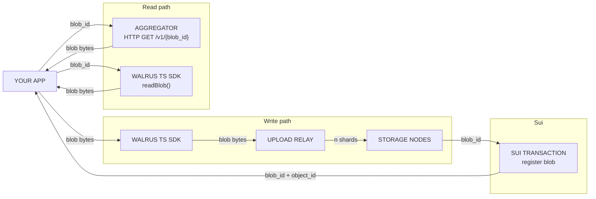

# Walrus — Decentralized Storage & Data Availability

Walrus is a decentralized storage and data availability protocol for large binary files (blobs). It uses Sui for coordination, payment, and governance.

> Source: [docs.wal.app](https://docs.wal.app), [Sui docs](https://docs.sui.io/sui-stack/walrus), [Walrus SDK docs](https://sdk.mystenlabs.com/walrus)

## Architecture



**Write path:** App → TS SDK → Upload Relay → Storage Nodes → Sui (register blob). Gets back `blob_id` + `object_id`.
**Read path:** App queries aggregator (`GET /v1/{blob_id}`) or TS SDK (`readBlob()`). Both return the raw blob bytes.

## Blob Storage

- All blobs are **public and discoverable** by anyone who knows the blob ID
- Uses **erasure coding**: encoded shards distributed across all storage nodes (~5x original size)
- **Content-addressed**: blob ID is a deterministic hash of the blob contents
- `WalrusFile` API groups multiple files into a single blob (more efficient than separate uploads)

> **⚠️ Never store secrets or private data on Walrus without encryption.** See [Seal](/sui-stack/seal/sui-stack-seal) for the encryption layer.

## Blob ID vs Object ID

| | Blob ID | Object ID |
|---|---|---|
| What | Content hash of blob data | Sui object ID of onchain registration |
| Computed | Offchain, deterministic from contents | Assigned by Sui at registration |
| Used for | Fetching blob bytes (aggregator/SDK) | Lifecycle management (ownership, transfer, delete, extend) |
| Example | `fetchFromWalrus(blobId)` | `executeDeleteBlobTransaction(objectId)` |

A `Post` Sui object stores the `image_blob_id` for frontend fetching and uses the object ID for onchain management.

## Components

### Storage Nodes

Servers storing encoded blob shards. Writing directly requires ~2,200 requests; reading requires ~335.

### Upload Relay

Server-side proxy accepting blob data from clients and distributing to storage nodes. Reduces write requests from ~2,200 to a single relay request. Essential for browser environments.

### Publisher

HTTP server accepting blobs via REST API. Handles the entire Walrus write flow. Simplest server-side integration. Use `send-object-to` parameter to retain ownership of blobs stored through a shared publisher.

### Aggregator

HTTP server serving blobs via `GET /v1/{blob_id}`. Works with standard caches and CDNs. Recommended for high-read-volume scenarios.

## Tooling

### CLI

```bash
walrus store ./image.png
walrus read <BLOB_ID> --output ./image.png
```

Used in OnlyFins seeding workflow to upload images before onchain registration.

### TS SDK (`@mysten/walrus`)

```bash
npm install --save @mysten/walrus @mysten/sui
```

```ts
import { SuiGrpcClient } from '@mysten/sui/grpc';
import { walrus } from '@mysten/walrus';

const client = new SuiGrpcClient({
  network: 'testnet',
  baseUrl: 'https://fullnode.testnet.sui.io:443',
}).$extend(walrus());
```

> **Note:** Prefer `SuiGrpcClient` from `@mysten/sui/grpc` over `SuiClient` from `@mysten/sui/client`. Both support identical Walrus APIs, but `SuiGrpcClient` is the recommended transport for new integrations.

For React apps, initialize the client in your root component and pass through React context.

## WalrusFile API

Groups multiple files into a single blob for storage efficiency:

```ts
import { WalrusFile } from '@mysten/walrus';

const files = [
  WalrusFile.from('./image1.png', { identifier: 'hero' }),
  WalrusFile.from('./image2.png', { identifier: 'thumb' }),
];
await client.writeFiles({ files, signer, epochs: 10 });
```

## Data Encryption

All blobs are public. For private content, encrypt before upload:

- **Seal** provides threshold encryption + onchain access control
- Frontend encrypts data, uploads encrypted blob to Walrus
- Decryption keys are released only after onchain access checks pass
- See the [Seal ecosystem reference](../seal/) for integration details

## OnlyFins Integration Example

Images stored on Walrus, blob IDs stored on `Post` Sui objects, aggregator used for serving:

```ts
// Constants
const AGGREGATOR_URL = 'https://aggregator.walrus-testnet.walrus.space';

// Fetch from aggregator (with retry + timeout)
function fetchFromWalrus(blobId: string): Promise<ArrayBuffer> {
  const url = `${AGGREGATOR_URL}/v1/blobs/${blobId}`;
  return fetch(url, { signal: AbortSignal.timeout(25_000) }).then(r => r.arrayBuffer());
}

// Post structure on Sui
// struct Post { image_blob_id: u256, encryption_id: Option<u256>, ... }
```

## Quick Reference

| Operation | Method | Notes |
|---|---|---|
| Write (SDK + Signer) | `client.writeBlob({ blob, signer, epochs })` | Server-side, single keypair |
| Write (browser wallet) | `client.writeFilesFlow({ files, signer, epochs })` | 5-step flow: encode/register/upload/certify/listFiles |
| Write (REST) | Publisher HTTP API | No TS SDK needed |
| Read (aggregator) | `GET /v1/{blob_id}` | Best for high volume, works with CDNs |
| Read (SDK) | `client.readBlob({ blobId })` | Direct, ~335 requests |
| Read attributes | `client.readBlobAttributes({ objectId })` | Key-value metadata on Sui blob object |
| Write attributes | `client.executeWriteBlobAttributesTransaction({ objectId, key, value })` | Update onchain metadata |
| Query owned blobs | `getOwnedObjects({ owner, filter: { StructType: 'package::blob::Blob' } })` | Same as any Sui object query |
| Delete blob | `client.executeDeleteBlobTransaction({ objectId })` | Must be registered with `deletable: true` |
| Extend lifetime | `client.extendBlob({ objectId, epochs })` | Add storage epochs before expiry |
| WalrusFile (write) | `client.writeFiles({ files, signer, epochs })` | Batch multiple files |
| WalrusFile (read) | `client.getFiles({ ids })` | Batch read, returns `WalrusFile[]` like `Response` objects |

## Reference Links

- [Walrus docs](https://docs.wal.app)
- [Walrus SDK docs](https://sdk.mystenlabs.com/walrus)
- [Walrus Onboarding modules](https://github.com/MystenLabs/Walrus-Onboarding)
- [walrus-pocs examples](https://github.com/MystenLabs/walrus-pocs)
- [write-from-wallet example](https://github.com/MystenLabs/ts-sdks/tree/main/packages/walrus/examples/write-from-wallet)
- [relay.wal.app (production demo)](https://relay.wal.app/)
