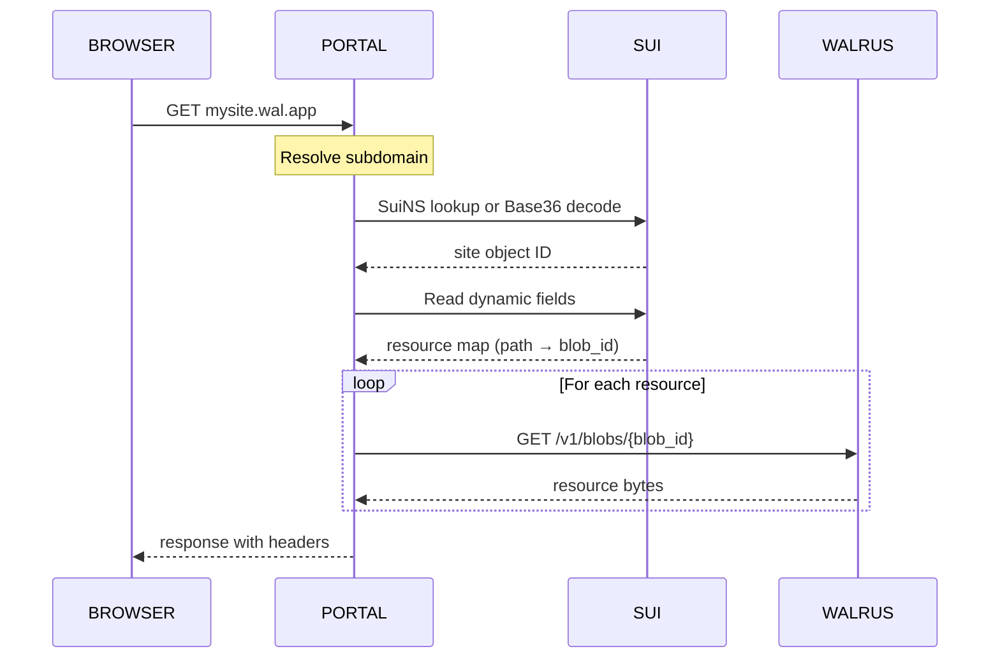

# Walrus Sites — Onchain Website Hosting

Deploy static websites to Walrus with an onchain Sui object tracking all resources. A portal server resolves subdomains and serves content over HTTP.

> Source: [Sui docs — Walrus Sites](https://docs.sui.io/sui-stack/walrus/sui-stack-walrus-sites), [Walrus Sites docs](https://docs.wal.app/docs/sites)

## The 4 Components

### 1. Site Files on Walrus

Static assets (HTML, CSS, JS, images, fonts) stored as blobs. The site-builder groups them into a **quilt** — a Walrus storage format reducing upload cost and improving speed. Each file gets a `QuiltPatchID` the site object uses to locate it.

### 2. Sui Site Object

Each site is one Sui object of type `site::Site`:

```move
struct Site has key, store {
    id: UID,
    name: String,
}
```

Resources are attached as dynamic fields of type `Resource`:

```move
struct Resource has store, drop {
    path: String,
    blob_id: u256,
}
```

The `path` maps to the URL path (e.g., `/index.html`), and `blob_id` locates the content on Walrus. The site object's owner controls updates and destruction.

### 3. Site-Builder CLI

Rust CLI tool for creating and managing Walrus Sites. Primary command: `deploy` (handles both publishing and updating).

### 4. Portals

A portal resolves and serves Walrus Sites to browsers:



The public Mainnet portal is `https://wal.app`. Self-host portals for Testnet.

## Installation

```bash
curl -sSfL https://raw.githubusercontent.com/MystenLabs/suiup/main/install.sh | sh
suiup install site-builder@mainnet
```

Ensure `$HOME/.local/bin` is in `PATH`.

## Configuration

Download `sites-config.yaml` for your network:

```bash
# Testnet
curl https://raw.githubusercontent.com/MystenLabs/walrus-sites/refs/heads/testnet/sites-config.yaml \
  -o ~/.config/walrus/sites-config.yaml

# Mainnet
curl https://raw.githubusercontent.com/MystenLabs/walrus-sites/refs/heads/mainnet/sites-config.yaml \
  -o ~/.config/walrus/sites-config.yaml
```

The file is looked for in: `cwd/`, `$XDG_CONFIG_HOME/walrus/`, `~/.config/walrus/`, `~/.walrus/`. Use `--config` to specify a custom path.

## Deploying a Site

### Requirements

- `index.html` at the root of the deploy directory
- Funded wallet with WAL (storage) and SUI (gas)
- Static site only (no server-side rendering)

```bash
# Build your site first
npm run build

# Deploy to Testnet (1 epoch = 1 day)
site-builder --context=testnet deploy dist/ --epochs 1

# Deploy to Mainnet (max: 53 epochs, 1 epoch = ~14 days)
site-builder --context=mainnet deploy dist/ --epochs 53
```

Successful output:
```
Created new site!
New site object ID: 0x6172...d7ac
For local development: http://2ffmxm7j...localhost:3000
```

Testnet has no public portal. Self-host a local portal to browse Testnet sites. Mainnet sites are served at `https://wal.app` after attaching a SuiNS name.

### Verify Deployment

```bash
site-builder sitemap --id 0x6172...d7ac
```

Lists all deployed resources. If the list matches your build output, the site is live.

### Web Frameworks

Point `site-builder` at the build output, not the project root:

| Framework | Deploy directory |
|---|---|
| Vite | `dist/` |
| Create React App | `build/` |
| Next.js (static export) | `out/` |
| Docusaurus | `build/` |

### CI/CD

```yaml
# .github/workflows/deploy-site.yml (OnlyFins pattern)
- name: Deploy to Walrus Sites
  run: |
    curl -sSfL https://raw.githubusercontent.com/MystenLabs/suiup/main/install.sh | sh
    suiup install site-builder@mainnet
    site-builder deploy dist/ --epochs 53
  env:
    WALRUS_SITES_PRIVATE_KEY: ${{ secrets.WALRUS_SITES_PRIVATE_KEY }}
```

## ws-resources.json

Configuration file `site-builder` reads during deployment. Auto-generated on first deploy. Not uploaded to Walrus.

```json
{
  "object_id": "0x6172...d7ac",
  "site_name": "My dApp",
  "metadata": {
    "description": "A decentralized application on Sui",
    "author": "team@example.com"
  },
  "headers": {
    "/assets/*.js": {
      "Cache-Control": "max-age=31536000, immutable"
    },
    "/api/**": {
      "Access-Control-Allow-Origin": "*"
    }
  },
  "routes": {
    "/*": "/index.html"
  },
  "redirects": {
    "/old-path": { "status": 301, "location": "/new-path" },
    "/external": { "status": 302, "location": "https://example.com" }
  },
  "ignore": [
    "*.map",
    ".DS_Store"
  ]
}
```

| Field | Description |
|---|---|
| `object_id` | Written by `deploy` after first publish. Subsequent deploys read it to update. |
| `site_name` | Human-readable name in the Sui site object. |
| `metadata` | Key-value pairs stored on the Sui object, shown in wallets. |
| `headers` | Custom HTTP response headers per path. Supports glob patterns. |
| `routes` | Client-side routing for SPAs. Wildcards only at end of pattern. |
| `redirects` | Static redirects with HTTP status codes. Internal paths or external URLs. |
| `ignore` | Path patterns to exclude from deployment. |

### SPA Routing

For React/Vue/Svelte apps with client-side routing, always configure a catch-all:

```json
{
  "routes": {
    "/*": "/index.html"
  }
}
```

Without this, direct navigation to `/my-route` returns 404.

## Updating a Site

`deploy` deletes all resources and re-uploads everything as a single quilt, even unchanged files:

```bash
# Rebuild, then deploy (reads object_id from ws-resources.json)
npm run build
site-builder --context=testnet deploy dist/ --epochs 1

# Update a different site
site-builder --context=testnet deploy --object-id 0x... dist/ --epochs 1
```

The wallet must own the site object.

## CLI Commands

| Command | Description |
|---|---|
| `deploy <DIR>` | Publish new or update existing site |
| `convert <OBJECT_ID>` | Convert object ID to Base36 subdomain |
| `sitemap --id <OBJECT_ID>` | List all deployed resources |
| `update-resource <PATH> <FILE>` | Add or replace a single resource |
| `destroy <OBJECT_ID>` | Permanently remove site (irreversible!) |

## Domain Names

### Base36 Subdomain

Derived from the site object ID. Format: `<base36-id>.wal.app`. Not supported on `wal.app` portal. Works on local servers and alternative portals.

### SuiNS (Required for Mainnet)

Register a `.sui` name and point it to your site object ID. The portal resolves SuiNS names to serve your site at `<name>.wal.app`. See [SuiNS docs](https://docs.wal.app/docs/sites/custom-domains/setting-a-suins-name) for the step-by-step process.

## Restrictions

- **Static only.** No server-side rendering, request handlers, or runtime redirects.
- **No secrets.** All content is public. Never embed API keys or credentials.
- **Max 3 redirects.** The `wal.app` portal enforces a maximum of 3 consecutive redirects.
- **No service workers.** PWAs not supported. iOS wallet in-app browsers cannot load. Does not apply to server-side portal.
- **SuiNS required for `wal.app`.** Base36 subdomains not served on `wal.app`.

## Failure Modes

| Error | Cause | Resolution |
|---|---|---|
| `site-builder` not found | Binary not in `PATH` | Add `$HOME/.local/bin` to `PATH` and reload shell |
| Insufficient WAL | No WAL tokens | Fund at [faucet.mystenlabs.com](https://faucet.mystenlabs.com) |
| Insufficient gas | No SUI tokens | Fund wallet with SUI on target network |
| Wallet does not own site | `--object-id` points to another wallet's site | Omit `--object-id` to publish new, or switch wallet |
| No `index.html` at root | Deploy pointed at project root, not build output | Point at `dist/`, `build/`, or `out/` |
| `ws-resources.json` validation error | Wildcard in middle of pattern | Move wildcards to end of patterns |
| Testnet site not browsable | No public Testnet portal | Self-host local portal |
| Base36 subdomain not working | `wal.app` requires SuiNS | Register SuiNS name |

## Local Portal (Testnet)

```bash
git clone https://github.com/MystenLabs/walrus-sites.git
cd walrus-sites/portal
bun install
cp portal-config.example.yaml portal-config.yaml
# Do NOT change original_package_id
bun run start
```

Access: `http://<base36-site-object-id>.localhost:3000`

If port 3000 is in use, kill the conflicting process first.

## Troubleshooting

1. **`site-builder` not found.** Check `$HOME/.local/bin` is in `PATH`. Reload shell profile.
2. **Gas/WAL insufficient.** Fund wallet at [faucet.mystenlabs.com](https://faucet.mystenlabs.com).
3. **Deploy fails but wrong wallet.** Run without `--object-id` to publish a new site.
4. **Missing `index.html`.** Point at framework build output directory, not project root.
5. **`ws-resources.json` validation.** Wildcards only at end of patterns.
6. **Testnet site unreachable.** Self-host a local portal for Testnet development.
