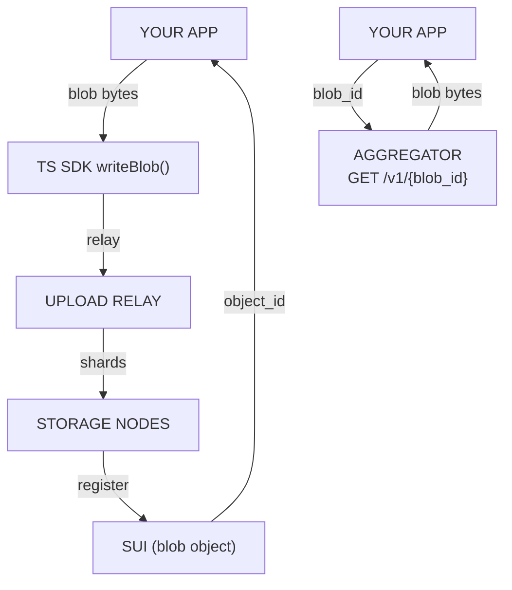

# Walrus Data Storage — Uploading, Reading & Managing Blobs

Comprehensive reference for storing and retrieving data on Walrus, drawn from the OnlyFins example app and Walrus Onboarding modules.

> Source: [Sui docs — Data Storage Using Walrus](https://docs.sui.io/sui-stack/walrus/sui-stack-walrus), [Walrus SDK docs](https://sdk.mystenlabs.com/walrus)

## Architecture Recap



## Uploading Data

### Using TS SDK with a Signer (Server-Side)

For backend scripts or jobs where a single keypair controls the wallet:

```ts
import { SuiGrpcClient } from '@mysten/sui/grpc';
import { walrus } from '@mysten/walrus';
import { Ed25519Keypair } from '@mysten/sui/keypairs/ed25519';

const client = new SuiGrpcClient({
  network: 'testnet',
  baseUrl: 'https://fullnode.testnet.sui.io:443',
}).$extend(walrus());

const keypair = Ed25519Keypair.fromSecretKey(/* private key bytes */);

// Direct upload (~2,200 requests)
const { blobId, objectId } = await client.writeBlob({
  blob: new Uint8Array(/* data */),
  signer: keypair,
  epochs: 10,
  deletable: true, // set false for permanent blobs
});

// Upload through relay (1 request)
const relayClient = new SuiGrpcClient({
  network: 'testnet',
  baseUrl: 'https://fullnode.testnet.sui.io:443',
}).$extend(walrus({
  uploadRelayUrl: 'https://relay.walrus-testnet.walrus.space',
}));
```

**OnlyFins pattern — Keypair signer in `backend/src/config.ts`:**

```ts
import { Ed25519Keypair } from '@mysten/sui/keypairs/ed25519';

export const authorKeypairs = [
  Ed25519Keypair.fromSecretKey(decodeSuiPrivateKey(process.env.AUTHOR_1_PRIVATE_KEY!)),
  Ed25519Keypair.fromSecretKey(decodeSuiPrivateKey(process.env.AUTHOR_2_PRIVATE_KEY!)),
];
```

**OnlyFins pattern — Registering posts with blob IDs (`backend/src/createPosts.ts`):**

```ts
const tx = new Transaction();
tx.moveCall({
  target: `${PACKAGE_ID}::posts::create_post`,
  arguments: [
    tx.pure.string('Post title'),
    tx.pure.string('Post description'),
    tx.pure.u256(blobId),           // image_blob_id
    tx.pure.option('u256', null),    // encryption_id (none for public)
  ],
});

const result = await client.signAndExecuteTransaction({
  transaction: tx,
  signer: authorKeypairs[0],
});
```

### Using TS SDK with User Wallets (Browser)

Browser wallets require popups triggered by user interaction. Use `writeFilesFlow` which splits the upload into 5 discrete steps:

```ts
// 1. Encode files and compute blob ID
const { blobId, encoded } = await client.encodeFiles({ files });

// 2. Register blob onchain (returns transaction for wallet to sign)
const { tx: registerTx } = await client.registerBlob({ blobId, encoded, epochs: 10 });

// 3. Upload data to storage nodes or relay
await client.uploadBlob({ blobId, encoded });

// 4. Certify blob onchain
const { tx: certifyTx } = await client.certifyBlob({ blobId });

// 5. List created files
const files = await client.listFiles({ blobId });
```

Reference implementations:
- [relay.wal.app](https://relay.wal.app/) — production demo with complete browser upload flow
- [write-from-wallet](https://github.com/MystenLabs/ts-sdks/tree/main/packages/walrus/examples/write-from-wallet) — concise example using `@mysten/dapp-kit-react`

### Using WalrusFile API (Batch Upload)

Store multiple files in a single blob for efficiency:

```ts
import { WalrusFile } from '@mysten/walrus';

const files = [
  WalrusFile.from('./hero.png', {
    identifier: 'hero',
    tags: { alt: 'Hero image', section: 'header' },
  }),
  WalrusFile.from('./thumbnail.png', {
    identifier: 'thumb',
    tags: { alt: 'Thumbnail' },
  }),
];

const { blobId } = await client.writeFiles({
  files,
  signer: keypair,
  epochs: 10,
});
```

Identifiers and tags travel with the blob and are retrievable during reads.

## Reading Data

### Finding Blobs to Read

Blob IDs are stored as fields on Sui objects. Query objects by ID:

```ts
// Fetch post objects and extract blob IDs
const { data } = await client.multiGetObjects({
  ids: postObjectIds,
  options: { showContent: true },
});

const posts = data.map(obj => ({
  postId: obj.data.objectId,
  imageBlobId: obj.data.content.fields.image_blob_id,
  encryptionId: obj.data.content.fields.encryption_id,
}));
```

### Reading with an Aggregator (Recommended for High Volume)

```ts
const AGGREGATOR_URL = 'https://aggregator.walrus-testnet.walrus.space';

async function fetchFromWalrus(blobId: string): Promise<ArrayBuffer> {
  const response = await fetch(`${AGGREGATOR_URL}/v1/blobs/${blobId}`, {
    signal: AbortSignal.timeout(25_000),
  });
  if (!response.ok) throw new Error(`Walrus fetch failed: ${response.status}`);
  return response.arrayBuffer();
}

// Use as image source
const blobUrl = `${AGGREGATOR_URL}/v1/blobs/${imageBlobId}`;
return ;
```

### Reading with the TS SDK

```ts
import { WalrusReadTimeoutError, WalrusBlobNotFoundError } from '@mysten/walrus';

try {
  const blob = await client.readBlob({ blobId });
  console.log('Blob bytes:', blob);
} catch (error) {
  if (error instanceof WalrusReadTimeoutError) {
    console.error('Storage nodes did not respond in time');
  } else if (error instanceof WalrusBlobNotFoundError) {
    console.error('Blob not found or expired');
  }
}
```

> **Note:** SDK reads require ~335 requests regardless of relay usage. Aggregator reads are significantly more efficient.

### Reading Metadata and Attributes

Blobs support key-value attributes stored as dynamic fields on the Sui blob object:

```ts
// Set attributes at upload
await client.writeBlob({
  blob: data,
  signer: keypair,
  epochs: 10,
  attributes: {
    'content-type': 'image/png',
    'app-section': 'hero',
  },
});

// Read attributes
const attrs = await client.readBlobAttributes({ objectId });
console.log(attrs['content-type']); // 'image/png'

// Update an attribute
await client.executeWriteBlobAttributesTransaction({
  objectId,
  key: 'app-section',
  value: 'sidebar',
  signer: keypair,
});

// Delete an attribute
await client.executeWriteBlobAttributesTransaction({
  objectId,
  key: 'app-section',
  value: null, // null = delete
  signer: keypair,
});
```

### Using WalrusFile API (Batch Read)

```ts
// Retrieve files by identifier from a batch blob
const { files } = await client.getFiles({ ids: [blobId] });

// files is like Response[] — supports arrayBuffer(), text(), json()
const heroFile = files.find(f => f.identifier === 'hero');
if (heroFile) {
  const buffer = await heroFile.arrayBuffer();
  // Use buffer...
}
```

## Managing Blobs

Blobs are Sui objects — manage them with the same tools and patterns.

### Querying Owned Blobs

```ts
import { useSuiClientQuery } from '@mysten/dapp-kit';

const WALRUS_PACKAGE_ID = '0x...'; // Walrus package ID for your network

const { data } = useSuiClientQuery('getOwnedObjects', {
  owner: currentAccount.address,
  filter: {
    StructType: `${WALRUS_PACKAGE_ID}::blob::Blob`,
  },
  options: { showContent: true },
});
```

Resolve SuiNS names for owner display:

```ts
import { useResolveSuiNSName } from '@mysten/dapp-kit';

function OwnerDisplay({ address }: { address: string }) {
  const { data: suinsName } = useResolveSuiNSName(address);
  return <span>{suinsName ?? `${address.slice(0, 6)}...${address.slice(-4)}`}</span>;
}
```

### Sharing Blobs

Wrap a blob in a shared object so anyone can fund and extend it. Currently only supported via Walrus CLI or Move.

### Deleting Blobs

Must be registered with `deletable: true`:

```ts
// Find blob object by ID
const blob = await client.getObject({
  id: blobObjectId,
  options: { showType: true },
});

// Execute delete
await client.executeDeleteBlobTransaction({
  objectId: blobObjectId,
  signer: keypair,
});
```

For browser wallets, compose with `useSignAndExecuteTransaction`:

```ts
import { useSignAndExecuteTransaction } from '@mysten/dapp-kit';

const { mutate: signAndExecute } = useSignAndExecuteTransaction();

function deleteBlob(objectId: string) {
  signAndExecute({
    transaction: walrus.executeDeleteBlobTransaction({ objectId }),
  });
}
```

### Extending Blob Lifetime

```ts
await client.extendBlob({
  objectId: blobObjectId,
  epochs: 10, // additional epochs to add
  signer: keypair,
});
```

## Common Patterns

### Server-Side Upload with CLI + PTB Registration (OnlyFins)

1. Upload images via Walrus CLI, record blob IDs
2. Build a PTB that calls `posts::create_post` with blob IDs
3. Execute PTB with a server-side keypair

```ts
// backend/src/createPosts.ts
const tx = new Transaction();
for (const post of posts) {
  tx.moveCall({
    target: `${PACKAGE_ID}::posts::create_post`,
    arguments: [
      tx.pure.string(post.title),
      tx.pure.string(post.description),
      tx.pure.u256(post.imageBlobId),
      tx.pure.option('u256', post.encryptionId ?? null),
    ],
  });
}
await client.signAndExecuteTransaction({ transaction: tx, signer: authorKeypair });
```

### Reading with Retry (Production Pattern)

```ts
async function fetchFromWalrus(blobId: string, retries = 3): Promise<ArrayBuffer> {
  for (let i = 0; i < retries; i++) {
    try {
      const res = await fetch(`${AGGREGATOR_URL}/v1/blobs/${blobId}`, {
        signal: AbortSignal.timeout(25_000),
      });
      if (!res.ok) throw new Error(`HTTP ${res.status}`);
      return await res.arrayBuffer();
    } catch (err) {
      if (i === retries - 1) throw err;
      await new Promise(r => setTimeout(r, 1000 * (i + 1)));
    }
  }
  throw new Error('Unreachable');
}
```

## Quick Reference

| Operation | API | Notes |
|---|---|---|
| **Write (server)** | `writeBlob({ blob, signer, epochs, deletable? })` | ~2,200 requests without relay |
| **Write (relay)** | `writeBlob()` with `uploadRelayUrl` config | Single request, required for browsers |
| **Write (browser)** | `writeFilesFlow()` — 5 steps | encode → register → upload → certify → listFiles |
| **Write (batch)** | `writeFiles({ files, signer, epochs })` | `WalrusFile.from()` for each file |
| **Read (aggregator)** | `fetch(AggregatorUrl/v1/blobs/{blobId})` | Recommended for high volume |
| **Read (SDK)** | `readBlob({ blobId })` | ~335 requests, typed error handling |
| **Read (batch)** | `getFiles({ ids })` | Returns `WalrusFile[]`, efficient for grouped files |
| **Read attrs** | `readBlobAttributes({ objectId })` | Key-value dynamic fields |
| **Write attrs** | `executeWriteBlobAttributesTransaction({ objectId, key, value })` | `null` value = delete attribute |
| **Query owned** | `getOwnedObjects({ owner, filter: { StructType } })` | Filter on `package::blob::Blob` |
| **Delete** | `executeDeleteBlobTransaction({ objectId })` | Requires `deletable: true` at registration |
| **Extend** | `extendBlob({ objectId, epochs })` | Add epochs before expiry |
| **Share** | CLI or Move only | Wraps in shared object |

## Caution

- **All blobs are public.** Encrypt sensitive data before upload (see [Seal overview](../seal/overview.md)).
- **~335 requests per SDK read.** Use aggregators for high-read-volume scenarios.
- **Use `SuiGrpcClient` from `@mysten/sui/grpc`**, not `SuiClient` from `@mysten/sui/client` for new integrations.
- **Expiry is in epochs.** On Mainnet, 1 epoch = ~14 days; on Testnet, 1 epoch = ~1 day. Max storage: 53 epochs.
