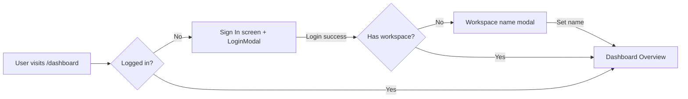
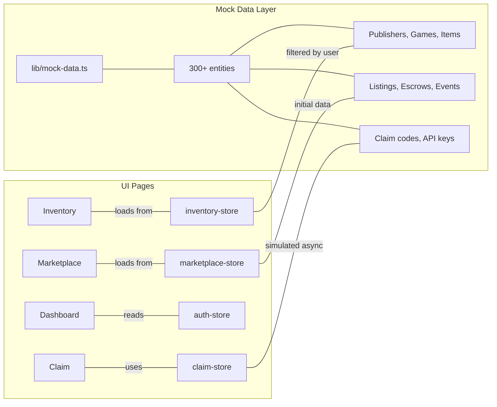

# Morita — UI Architecture & Flow Summary

> **Track:** DeFi & Payments (Sui Overflow 2026)
> **Auth:** Google OAuth only (via Enoki zkLogin)

---

## 1. Route Structure

### Gamer Hub (`(hub)`)

| Route | Page | Auth Required | Description |
|---|---|---|---|
| `/marketplace` | `marketplace/page.tsx` | No | Browse sale + barter listings, tabs, filters |
| `/inventory` | `inventory/page.tsx` | Yes | Grid of owned items, Sell/Barter actions |
| `/inventory/[itemId]` | `inventory/[itemId]/page.tsx` | Yes | Full item detail, Sell/Barter buttons |
| `/history` | `history/page.tsx` | Yes | Transaction timeline grouped by date |
| `/claim?code=xxx` | `claim/page.tsx` | No | Claim code redemption (idle→loading→success/error) |
| `/barter/[id]` | `barter/[id]/page.tsx` | No | Escrow detail, conditions, Cancel/Fulfill |

### Developer Dashboard (`(dashboard)/dashboard`)

| Route | Page | Description |
|---|---|---|
| `/dashboard` | `dashboard/page.tsx` | Overview with MetricCards, quick nav, activity feed |
| `/dashboard/games` | `dashboard/games/page.tsx` | Games list, Create Game modal |
| `/dashboard/games/[game_id]` | `games/[game_id]/page.tsx` | Game detail with 5 tabs (Overview, Items, API Keys, Analytics, Activity) |
| `/dashboard/games/[game_id]/api-keys` | `api-keys/page.tsx` | API key table, generate/revoke |
| `/dashboard/games/[game_id]/items` | `items/page.tsx` | Filterable items grid |
| `/dashboard/games/[game_id]/items/[item_id]` | `items/[item_id]/page.tsx` | Item edit (draft) or read-only (published) |
| `/dashboard/analytics` | `analytics/page.tsx` | MetricCards, charts (placeholder), per-game breakdown |
| `/dashboard/activity` | `activity/page.tsx` | Event log with filters |
| `/dashboard/settings` | `settings/page.tsx` | Publisher profile edit, danger zone (future) |

### Landing

| Route | Page | Description |
|---|---|---|
| `/` | `page.tsx` | Hero with scroll animation, 8 sections, Login modal |

---

## 2. Auth Flow

```mermaid
flowchart TD
    A[User clicks Login / Sign In] --> B[LoginModal]
    B --> C[Step 1: OAuth - Click "Continue with Google"]
    C --> D[Simulate Google redirect...]
    D --> E[Step 2: Username input]
    E --> F[Submit username]
    F --> G[Step 3: Generate Sui Wallet via Enoki zkLogin]
    G --> H[authStore.login(name)]
    H --> I{redirectTo param?}
    I -->|yes| J[router.push(redirectTo)]
    I -->|no| K[router.push('/inventory')]
    
    L[User clicks Logout] --> M[authStore.logout]
    M --> N[Redirect to landing /]
```

**Auth Store (Zustand):**
- `isLoggedIn`, `displayName`, `suiAddress`, `hasSetWorkspace`, `workspaceName`
- Methods: `login(name)`, `logout()`, `setWorkspace(name)`

**Key decisions:**
- Google OAuth only (no Twitch)
- 1 workspace per user (no multi-publisher)
- First-time Dev login triggers "Name Your Workspace" modal
- Login modal supports `redirectTo` prop for callback-based redirect

---

## 3. Login Flow (Page by Page)

### Landing Page (`/`)
```mermaid
flowchart LR
    A[Landing Header] -->|"Click 'Developer'"| B[/dashboard]
    C[Hero Section] -->|"Click 'Play' / 'Connect'"| D[LoginModal]
    D -->|After login| E[/inventory]
```

### Dashboard (`/dashboard`)


---

## 4. Component Structure

### Shared Components (27 total)

```
components/
├── landing/          (landing page sections)
│   ├── header.tsx          — Sticky nav with scroll bar + "Developer" button
│   ├── hero.tsx            — GSAP ScrollTrigger curtain animation
│   ├── marquee.tsx         — Infinite brand logos
│   ├── how-it-works.tsx    — 4-step grid with code snippets
│   ├── sandbox-playground.tsx — motion/react timeline
│   ├── marketplace-preview.tsx — 4 card grid
│   ├── tech-bento.tsx      — 3 card: Enoki/Kiosk/Walrus
│   ├── faq.tsx             — Accordion FAQ
│   ├── footer.tsx          — Blueberry banner + social
│   └── login-modal.tsx     — 3-step auth (OAuth → username → wallet generation)
│
└── shared/            (reusable across Hub + Dashboard)
    ├── topbar.tsx           — Hub navigation (Marketplace, Inventory, History)
    ├── sidebar.tsx          — Dashboard sidebar (Overview, Games, Analytics, Activity, Settings)
    ├── wallet-button.tsx    — Connect/Disconnect wallet button
    ├── item-card.tsx        — GameItem card (grid/compact variants)
    ├── item-detail.tsx      — Full item view with attributes table
    ├── listing-row.tsx      — Marketplace sale row with Buy Now
    ├── escrow-card.tsx      — Barter card with conditions
    ├── filter-bar.tsx       — Search + dropdown filters + sort
    ├── confirm-modal.tsx    — Confirmation dialog with danger variant
    ├── empty-state.tsx      — Empty state with icon, message, CTA
    ├── metric-card.tsx      — Analytics stat card
    ├── status-badge.tsx     — Draft/Published/Paused/Verified badges
    ├── rarity-badge.tsx     — Common/Uncommon/Rare/Epic/Legendary
    ├── game-badge.tsx       — Game name tag
    ├── publisher-switcher.tsx — Dropdown workspace selector
    ├── publish-progress-bar.tsx — Vertical stepper for publish flow
    └── tx-status-toast.tsx  — Submitting/confirmed/error toast
```

---

## 5. State Management (Zustand)

### Stores

```
stores/
├── auth-store.ts         — isLoggedIn, displayName, workspaceName, login/logout/setWorkspace
├── inventory-store.ts    — items[], setItems, removeItem, getItemById
├── marketplace-store.ts  — listings[], escrows[], filter/sort state
├── publisher-store.ts    — isPublishing, publishProgress
└── claim-store.ts        — state (idle/loading/success/error), claim/reset
```

### Data Flow (Mock)



---

## 6. Key UI Flows

### Publish Game Flow
```mermaid
flowchart TD
    A[Draft game in GameDetail] --> B[Tab: Overview]
    B --> C[Publish Game button]
    C --> D[ConfirmModal: "Publish X items?"]
    D -->|Confirm| E[PublishProgressBar]
    E --> F[Step 1: Upload Assets ~done~]
    F --> G[Step 2: Deploy on-chain ~done~]
    G --> H[Step 3: Done]
    H --> I[Draft→Published, API key generated]
```

### Create Game Flow
```mermaid
flowchart TD
    A[/dashboard/games] --> B[Create Game button]
    B --> C[Modal: Name, Genre, Description]
    C --> D[Create button]
    D --> E[Console.log mock + close modal]
```

### Marketplace Browsing
```mermaid
flowchart TD
    A[/marketplace] --> B[Tab: All / For Sale / For Barter]
    A --> C[FilterBar: search, rarity, sort]
    B -->|Sale| D[ListingRow: item + price + Buy Now]
    B -->|Barter| E[EscrowCard: offered + conditions + Fulfill]
    D --> F[Buy Now → console.log('Buy')]
    E --> G[Fulfill → navigate to /barter/:id]
```

---

## 7. Design System — Swiss Neo-Brutalist

### Colors
| Token | Hex | Usage |
|---|---|---|
| `brand-bg` | `#FCFBF2` | Page backgrounds (warm cream) |
| `border-dark` | `#1E2044` | Borders, headings, dark text |
| `blueberry` | `#5A60D3` | CTAs, badges, focus rings |
| `blueberry-dark` | `#2E3166` | Deep accents |
| `blueberry-light` | `#D2D7FC` | Hover states, passive badges |

### Typography
| Font | CSS Var | Usage |
|---|---|---|
| Space Grotesk | `--font-display` | Headings, uppercase, font-black |
| Inter | `--font-sans` | Body text, inputs, descriptions |
| JetBrains Mono | `--font-mono` | Metadata, code, IDs, technical pills |

### Reusable Patterns
- **Card**: `border-3 border-[#1E2044] rounded-2xl shadow-[4px_4px_0px_0px_var(--color-border-dark)]`
- **Primary Button**: `bg-blueberry text-white border-3 border-[#1E2044] font-display font-black rounded-xl shadow-[3px_3px_0px_0px_var(--color-border-dark)] hover:-translate-y-0.5 transition-all`
- **Badge**: `text-[10px] font-mono font-extrabold uppercase tracking-wider px-2 py-0.5 rounded-md border-2`
- **Input**: `bg-blueberry-cream/10 text-sm font-sans text-[#1E2044] px-4 py-3 border-2 border-[#1E2044] rounded-xl focus:outline-none focus:ring-2 focus:ring-blueberry/25`

---

## 8. Key Design Decisions

| # | Decision | Rationale |
|---|---|---|
| D1 | Google-only OAuth (no Twitch) | MVP simplification |
| D2 | 1 workspace per user | Reduces complexity for MVP |
| D3 | Workspace name on first Dev login | Avoids empty publisher state |
| D4 | Login callback redirect | Better UX — stay on intended page |
| D5 | Flat dashboard routes (no `[publisher_id]`) | Only 1 workspace, simpler URLs |
| D6 | Publish button only in Overview tab | Clearer UX — don't mix contexts |
| D7 | Sidebar active = exact match for `/dashboard` | Prevents false highlights |
| D8 | No verified badges in MVP | Simplifies UI |
| D9 | Mock auth → login → Hub | All flows testable end-to-end |
| D10 | Zustand over React Context | Simpler, no boilerplate, persistent state |

---

## 9. Build Status

```
✅ Build passes — 17 routes, TypeScript clean, all pages render
✅ Landing page — 10 components, GSAP animations
✅ Gamer Hub — 6 pages (inventory, marketplace, barter, claim, history, item detail)
✅ Developer Dashboard — 9 pages (overview, games, game detail, items, api-keys, analytics, activity, settings, item edit)
✅ Shared components — 17 Neo-Brutalist components
✅ Mock data — 300+ entities across stores
✅ Zustand stores — 5 stores (auth, inventory, marketplace, publisher, claim)
✅ Zod schemas — 5 schemas (item, game, publisher, listing, escrow)
✅ Auth flow — Login → OAuth → username → wallet generation → redirect callback
```

> **Next:** Smart Contracts (Sui Move) → Database (Drizzle) → Enoki Integration → Server Actions → Hono API
