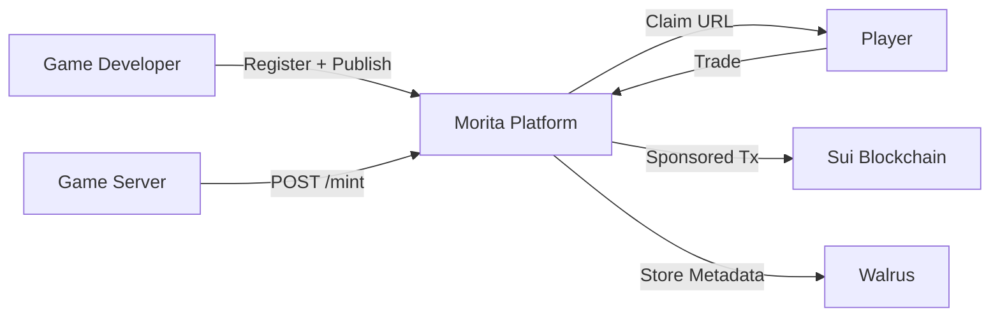

# Morita — Business Flow (Judges)

> Cross-game inventory & commerce protocol on Sui.
> Sui Overflow 2026 | DeFi & Payments Track

---

## The Problem

Game items are trapped inside their ecosystems. Players cannot sell, trade, or transfer items between games. Developers lack infrastructure to tokenize assets.

## The Solution — Three Actors, One Platform



---

## Flow 1 — Game Developer Onboarding

```
Google Login → Create Publisher → Create Game (draft)
→ Create Items (draft) → Publish Game
→ Receive API Key → Integrate game server
```

**Business value:** Devs get a dashboard + REST API to tokenize items. No blockchain knowledge needed. Gas is sponsored.

---

## Flow 2 — Player Claims Item

```
Game Server → POST /api/v1/game/:id/item/mint → Claim URL
Player → Opens URL → Enoki Login (Google OAuth) → Sees Item Preview
→ Clicks "Claim" → Item minted on-chain → Appears in Inventory
```

**Business value:** Players earn items in-game, claim them on Sui with one click. Zero gas, zero wallet setup.

---

## Flow 3 — Marketplace

```
Player A → List item for sale (optional royalty)
Player B → Browse marketplace → Buy item
→ SUI to seller, item to buyer. Royalties auto-split via Sui Kiosk.
```

**Business value:** Trust-minimized P2P trading. Royalties optional for creators.

---

## Flow 4 — Cross-Game Barter

```
Player A → Lock item in escrow (set conditions)
Player B → Fulfill barter → Atomic swap in 1 transaction
```

**Business value:** Trade items across different games. Value gap can be covered with SUI.

---

## Key Differentiators

| Feature | How Morita Does It |
|---------|-------------------|
| **Authentication** | Google OAuth via Enoki zkLogin — no wallet extension needed |
| **Gas** | 100% sponsored by Enoki — users never need SUI |
| **Item Storage** | Metadata on Walrus (immutable, decentralized), ownership on Sui |
| **Marketplace** | Sui Kiosk with optional royalties |
| **Cross-Game Barter** | Atomic swap via PTB — 1 transaction, 2 games |
| **Developer API** | Simple REST — `POST /api/v1/game/:id/item/mint` with bearer token |

---

## Why Sui

| Primitive | Usage |
|-----------|-------|
| **Enoki** | Auth (Google OAuth) + gas sponsorship for all transactions |
| **Sui Kiosk** | Royalty-enforced marketplace |
| **Programmable Transaction Blocks** | Atomic barter (swap 2 items in 1 tx) |
| **Walrus** | Decentralized item metadata storage |
| **Object Model** | Each item is a first-class Sui object |

---

## Demo Flow (5 min)

1. Dev logs in → Creates publisher → Creates game + items → Publishes → Gets API key
2. Game server calls API → Claim URL generated → Player opens → Logs in → Claims item
3. Player lists item for sale → Another player buys → Kiosk splits payment
4. Player creates barter escrow → Another fulfills → Atomic swap
