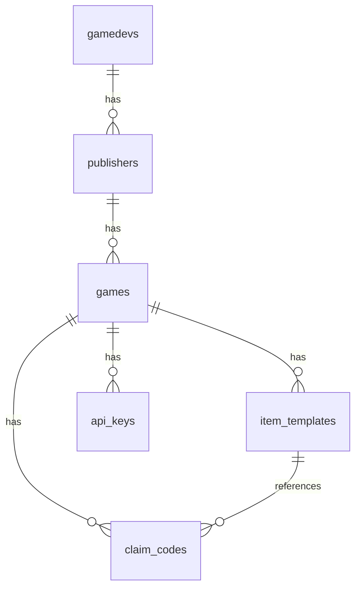

# Morita — Technical Architecture (Developers)

> Internal reference for understanding the full-stack architecture, file wiring, and data flow.

---

## Tech Stack

| Layer | Technology | Version |
|-------|-----------|---------|
| Runtime | Bun | 1.3.x |
| Framework | Next.js (App Router) | 16.2.9 |
| Language | TypeScript | 5.x |
| Smart Contracts | Sui Move | 2024 edition |
| Database | PostgreSQL 17 + Drizzle ORM | 0.45.x |
| Auth & Gas | Enoki (zkLogin + Sponsored Tx) | 1.1.1 |
| Storage | Walrus (Aggregator + SDK) | 1.2.1 |
| External API | Hono (mounted on Next.js) | 4.12.x |
| State | Zustand + TanStack React Query | 5.x |
| Styling | Tailwind CSS v4 | 4.x |

---

## Architecture Overview

```
┌──────────────────────────────────────────────────────────────────┐
│                         FRONTEND (Next.js)                       │
│  ┌────────────┐  ┌──────────────┐  ┌───────────────────────────┐│
│  │ Gamer Hub  │  │ Dev Dashboard│  │ AuthWatcher LoginModal    ││
│  └─────┬──────┘  └──────┬───────┘  │ (no EnokiFlow — server)  ││
│        │                │          └───────────────────────────┘│
│        └────────────────┼──────────────────────────────┘        │
│                    actions/*.ts  (server actions)                │
└─────────────────────────┬───────────────────────────────────────┘
                          │
┌─────────────────────────┴───────────────────────────────────────┐
│                     BACKEND (Next.js)                            │
│  ┌─────────────────┐  ┌────────────────┐  ┌───────────────────┐│
│  │ actions/        │  │ services/       │  │ lib/              ││
│  │ (server actions)│──│ (business logic)│──│ (platform utils)  ││
│  │ thin wrappers   │  │ DB + PTB calls  │  │ sui + enoki + db  ││
│  └─────────────────┘  └────────────────┘  └───────────────────┘│
│                      ┌────────────────────────────────────────┐│
│                      │  app/api/[[...route]]/route.ts         ││
│                      │  (Hono — 4 external endpoints)          ││
│                      └────────────────────────────────────────┘│
└─────────┬──────────────────────────────┬────────────────────────┘
          │                              │
┌─────────┴──────────┐  ┌───────────────┴──────────────────────┐
│   Sui Blockchain   │  │         PostgreSQL (11 tables)       │
│  ┌───────────────┐ │  │ gamedevs, publishers, games,         │
│  │ 4 Move modules│ │  │ item_templates, claim_codes,         │
│  │ + Walrus      │ │  │ api_keys, user_kiosks, kiosk_listings│
│  └───────────────┘ │  │ escrow_index, item_cache, tx_events  │
└───────────────────┘  └──────────────────────────────────────┘
```

---

## Two Signing Flows

**Note:** EnokiFlow is NOT used client-side. All Enoki API calls (ZKP, nonce, zkLogin info) are proxied through server actions using the private key.

### executeAsAdmin — Platform signs, no user involvement
```
Backend: build PTB → Enoki sponsor (sender=admin) → sign with ADMIN_KEY → execute
```
Used for: `mint`, `redeemClaimCode`, admin operations.

### sponsorForUser + executeUserSigned — User signs, backend sponsors
```
Frontend: build PTB → tx.setSender(suiAddress) → tx.build({ client, onlyTransactionKind }) → txBytes
       → Backend: Enoki sponsor (sender=user) → { bytes, digest }
       → Frontend: readProof from server action → construct EnokiKeypair → sign bytes → { signature }
       → Backend: executeUserSigned(digest, signature) → finalize
```
Used for: `createPublisher`, `publishGame`, `listForSale`, `buyItem`, all escrow operations.

---

## File Wiring Map

### Layer 1 — Smart Contracts (`contract/sources/`)

| File | Module | Public Functions | Key Structs |
|------|--------|-----------------|-------------|
| `registry.move` | `morita::registry` | `create_publisher`, `verify_publisher`, `initiate_publish`, `finalize_publish`, `update_game`, `pause_game`, `resume_game` | `AdminCap`, `Publisher`, `Game`, `GameCapability`, `PublishTicket` |
| `item.move` | `morita::item` | `mint`, `burn` + 4 accessors | `GameItem` (key, store) |
| `kiosk_ext.move` | `morita::kiosk_ext` | `list_for_sale`, `buy_item`, `create_transfer_policy` | `ItemListed`, `ItemSold` events |
| `escrow.move` | `morita::escrow` | `lock_item_for_any`, `lock_item_for_target`, `fulfill_escrow`, `fulfill_escrow_with_value`, `cancel_escrow` | `Escrow`, `EscrowConditions` |

### Layer 2 — PTB Builders (`lib/sui/ptb.ts`)

| Function | Contract Target | Used By |
|----------|---------------|---------|
| `mint(gameId, capId, itemId, type, rarity, blobId, supply, recipient)` | `item::mint` | `claim-service.ts` |
| `burn(gameId, capId, itemId)` | `item::burn` | Hono API (stub) |
| `createPublisher(name)` | `registry::create_publisher` | Frontend → `user-transaction.ts` |
| `publish(publisherId, gameName, platformAddr)` | `registry::initiate_publish` + `finalize_publish` | Frontend → `user-transaction.ts` |
| `listForSale(itemId, kioskId, capId, price, royaltyBps)` | `kiosk_ext::list_for_sale` | Frontend → `user-transaction.ts` |
| `buyItem(kioskId, policyId, itemId, price)` | `kiosk_ext::buy_item` | Frontend → `user-transaction.ts` |
| `lockForAny(itemId, conditions)` | `escrow::lock_item_for_any` | Frontend → `marketplace.ts` |
| `lockForTarget(itemId, conditions, counterparty)` | `escrow::lock_item_for_target` | Frontend → `marketplace.ts` |
| `fulfill(escrowId, myItemId)` | `escrow::fulfill_escrow` | Frontend → `marketplace.ts` |
| `fulfillWithValue(escrowId, myItemId, topup)` | `escrow::fulfill_escrow_with_value` | Frontend → `marketplace.ts` |
| `cancel(escrowId)` | `escrow::cancel_escrow` | Frontend → `marketplace.ts` |

### Layer 3 — Enoki Client (`lib/sui/enoki-client.ts`)

| Function | Purpose |
|----------|---------|
| `executeAsAdmin(tx, targets)` | Build PTB → Enoki sponsor → admin sign → execute. Sender = admin |
| `sponsorForUser(txBytes, user, targets)` | Sponsor tx for user. Returns `{ bytes, digest }`. Sender = user |
| `executeUserSigned(digest, signature)` | Execute after user signs the sponsored bytes |

### Layer 4 — Services (`services/*.ts`)

| Service | DB Tables | On-Chain Calls | Exported Functions |
|---------|-----------|---------------|-------------------|
| `publisher-service.ts` | `gamedevs`, `publishers` | None (DB only) | `getOrCreateDev`, `getMyPublishers`, `getPublisherDetail`, `createPublisherRecord` |
| `game-service.ts` | `games`, `item_templates`, `api_keys` | None (DB only) | `createGame`, `updateGame`, `deleteGame`, `listGames`, `getGame`, `finalizePublish` |
| `item-service.ts` | `item_templates`, `claim_codes` | None (DB only) | `saveDraft`, `deleteDraft`, `listItems`, `getItem`, `getClaimInfo` |
| `claim-service.ts` | `claim_codes`, `games`, `item_templates` | `executeAsAdmin(mint)` | `generateClaimCode`, `createClaimCode`, `redeem` |
| `marketplace-service.ts` | `escrow_index` | None (DB only) | `getListings`, `getListingDetail`, `createEscrowRecord`, `markFulfilled`, `markCancelled` |
| `api-key-service.ts` | `api_keys` | None (DB only) | `generate`, `revoke`, `list`, `validate` |

### Layer 5 — Server Actions (`actions/*.ts`)

| Action | Imports Service | Exported Functions |
|--------|-----------------|-------------------|
| `publisher.ts` | `publisher-service` | `getSession`, `createPublisher` |
| `game.ts` | `game-service` | `create`, `update`, `del`, `list`, `detail`, `publish` |
| `item.ts` | `item-service` | `save`, `del`, `list`, `detail`, `claimInfo` |
| `claim.ts` | `claim-service` | `redeemCode` |
| `marketplace.ts` | `marketplace-service` + `enoki-client` | `sponsorTxBytes`, `executeSignedTx`, `getMarketplaceListings`, `getListingDetail` |
| `api-keys.ts` | `api-key-service` | `createKey`, `revokeKey`, `getKeys` |
| `user-transaction.ts` | `enoki-client` | `sponsorTransaction`, `executeTransaction` |

### Layer 6 — Hono External API (`app/api/[[...route]]/route.ts`)

| Endpoint | Method | Auth | What It Does |
|----------|--------|------|-------------|
| `/api/v1/game/:gameId/item/mint` | POST | API Key | Creates `claim_codes` row → returns claim URL |
| `/api/v1/game/:gameId/item/burn` | POST | API Key | Stub — returns empty digest |
| `/api/v1/game/:gameId/inventory/:address` | GET | API Key | Stub — returns `{ items: [], total: 0 }` |
| `/api/v1/game/:gameId/item/:itemId` | GET | API Key | Stub — returns `{ item: null }` |

### Layer 7 — Frontend (`app/` + `components/`)

| Component/Page | Purpose | Connected To |
|---------------|---------|-------------|
| `providers.tsx` | `EnokiFlowProvider` + `DAppKitProvider` + `QueryClientProvider` | `auth-watcher.tsx` |
| `auth-watcher.tsx` | Syncs `useZkLogin()` → Zustand `auth-store` | `stores/auth-store.ts` |
| `login-modal.tsx` | Google OAuth via EnokiFlow → createAuthorizationURL | `providers.tsx`, `auth-store.ts` |
| `auth/callback/page.tsx` | Handles OAuth redirect → `handleAuthCallback()` | `providers.tsx` |

---

## Database Schema (10 Tables)



All table definitions: `lib/db/schema.ts`

---

## Smart Contract Access Control Summary

| Function | Authorized Sender | Guard Mechanism |
|----------|------------------|-----------------|
| `create_publisher` | Anyone | None |
| `verify_publisher` | AdminCap holder | `&AdminCap` parameter |
| `initiate_publish` | Publisher owner | `assert!(pub_.owner == ctx.sender())` |
| `finalize_publish` | Publisher owner | Hot potato consumption (same PTB) |
| `update_game` | GameCapability holder | `&GameCapability` parameter |
| `pause/resume` | AdminCap holder | `&AdminCap` parameter |
| `mint` | GameCapability holder | `&GameCapability` parameter |
| `burn` | GameCapability holder | `&GameCapability` parameter |
| `list_for_sale`, `buy_item` | Kiosk owner / Buyer | Kiosk access controls |
| `lock_item_for_any` | Item owner | Item passed by value |
| `fulfill_escrow` | Third party (not initiator) | `ctx.sender() != escrow.initiator` |
| `cancel_escrow` | Initiator | `ctx.sender() == escrow.initiator` |
