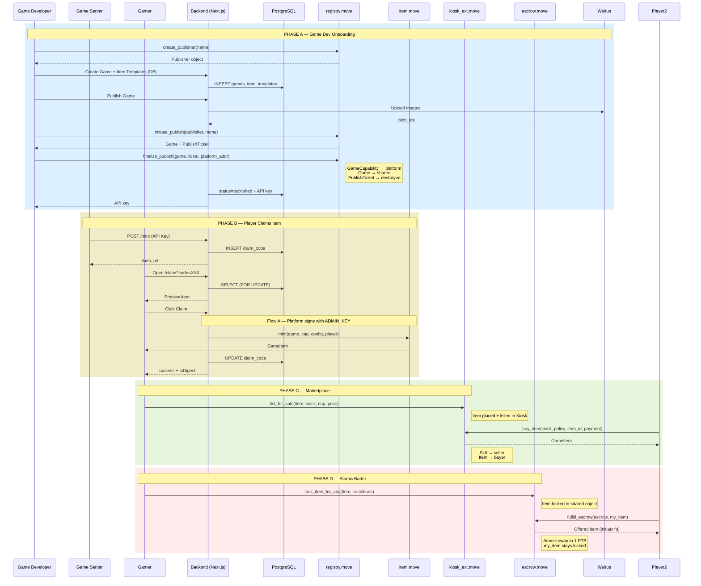
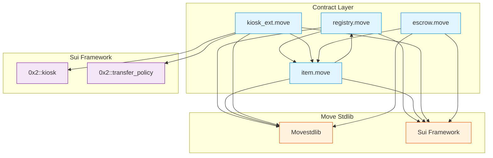
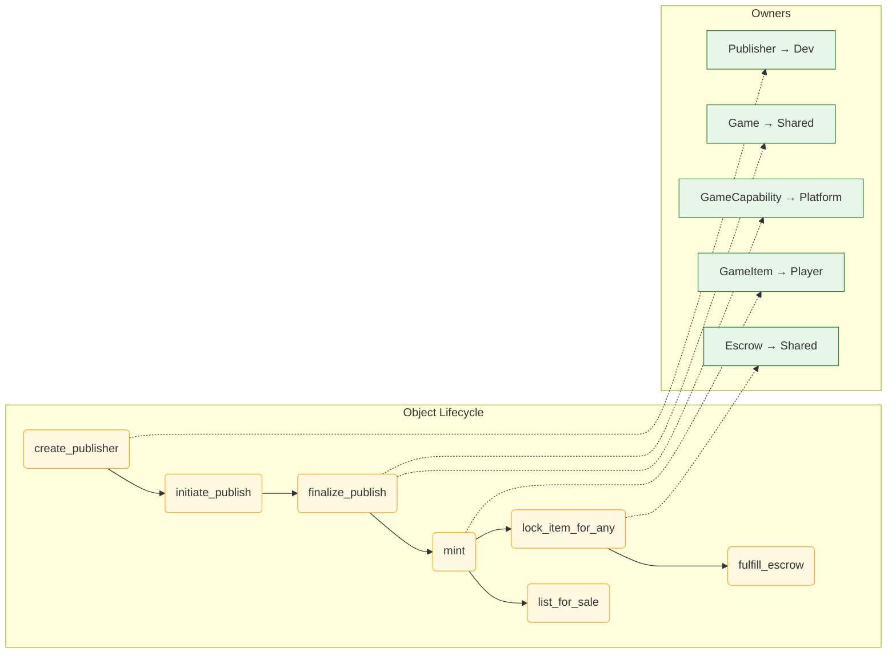
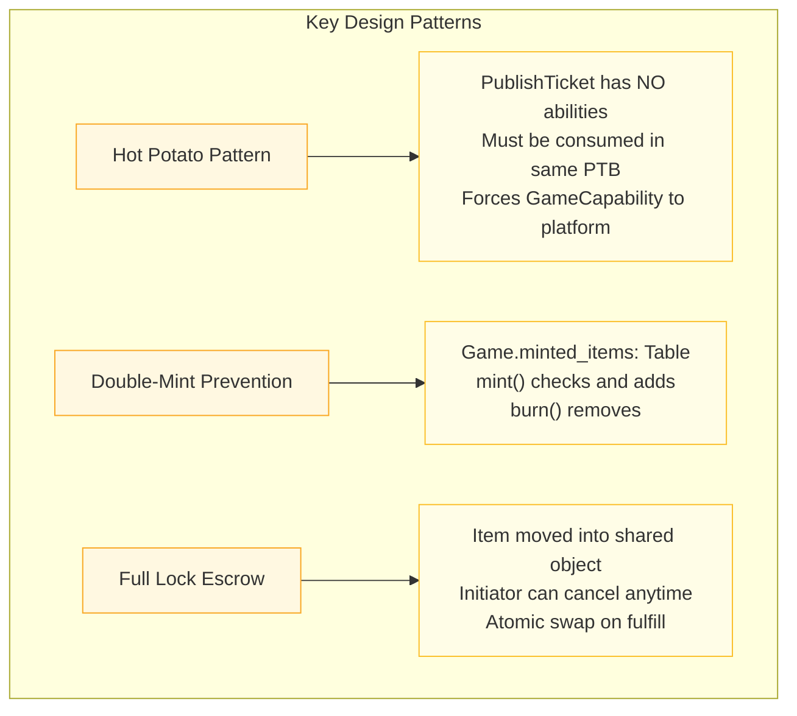

# Morita — Smart Contract Flow Diagrams

---

## Diagram 1: Business Flow

```mermaid
sequenceDiagram
    participant Dev as Game Developer
    participant GS as Game Server
    participant Player as Gamer
    participant Backend as Backend (Next.js)
    participant DB as PostgreSQL
    participant Registry as registry.move
    participant Item as item.move
    participant KioskExt as kiosk_ext.move
    participant Escrow as escrow.move
    participant Walrus

    rect rgb(220, 240, 255)
        Note over Dev, Walrus: PHASE A — Game Dev Onboarding

        Dev->>Registry: create_publisher(name)
        Registry-->>Dev: Publisher object

        Dev->>Backend: Create Game + Item Templates (DB)
        Backend->>DB: INSERT games, item_templates

        Dev->>Backend: Publish Game
        Backend->>Walrus: Upload images
        Walrus-->>Backend: blob_ids

        Dev->>Registry: initiate_publish(publisher, name)
        Registry-->>Dev: Game + PublishTicket
        
        Dev->>Registry: finalize_publish(game, ticket, platform_addr)
        Note right of Registry: GameCapability → platform<br/>Game → shared<br/>PublishTicket → destroyed

        Backend->>DB: status=published + API key
        Backend-->>Dev: API key
    end

    rect rgb(240, 235, 200)
        Note over GS, Item: PHASE B — Player Claims Item

        GS->>Backend: POST /mint (API Key)
        Backend->>DB: INSERT claim_code
        Backend-->>GS: claim_url

        Player->>Backend: Open /claim?code=XXX
        Backend->>DB: SELECT (FOR UPDATE)
        Backend-->>Player: Preview item

        Player->>Backend: Click Claim
        Note over Backend, Item: Flow A — Platform signs with ADMIN_KEY
        Backend->>Item: mint(game, cap, config, player)
        Item-->>Player: GameItem
        Backend->>DB: UPDATE claim_code
        Backend-->>Player: success + txDigest
    end

    rect rgb(230, 245, 220)
        Note over Player, KioskExt: PHASE C — Marketplace

        Player->>KioskExt: list_for_sale(item, kiosk, cap, price)
        Note right of KioskExt: Item placed + listed in Kiosk

        Player2->>KioskExt: buy_item(kiosk, policy, item_id, payment)
        KioskExt-->>Player2: GameItem
        Note right of KioskExt: SUI → seller<br/>Item → buyer
    end

    rect rgb(255, 235, 235)
        Note over Player, Escrow: PHASE D — Atomic Barter

        Player->>Escrow: lock_item_for_any(item, conditions)
        Note right of Escrow: Item locked in shared object

        Player2->>Escrow: fulfill_escrow(escrow, my_item)
        Escrow-->>Player2: Offered item (initiator's)
        Note right of Escrow: Atomic swap in 1 PTB<br/>my_item stays locked
    end
```

---

## Diagram 2: Contract Dependencies & Object Lifecycle

```mermaid
flowchart TB
    subgraph Contract Layer
        R[registry.move]
        I[item.move]
        K[kiosk_ext.move]
        E[escrow.move]
    end

    subgraph Sui Framework
        SK[0x2::kiosk]
        TP[0x2::transfer_policy]
    end

    subgraph Move Stdlib
        MS[Movestdlib]
        SF[Sui Framework]
    end

    R --> I
    I --> R
    K --> SK
    K --> TP
    K --> I
    E --> I
    R --> MS
    I --> MS
    K --> MS
    E --> MS
    R --> SF
    I --> SF
    K --> SF
    E --> SF
    
    classDef mod fill:#e1f5fe,stroke:#0288d1
    class R,I,K,E mod
    classDef fx fill:#f3e5f5,stroke:#7b1fa2
    class SK,TP fx
    classDef std fill:#fff3e0,stroke:#e65100
    class MS,SF std
```

```mermaid
flowchart LR
    subgraph Object Lifecycle
        A(create_publisher) --> B(initiate_publish)
        B --> C(finalize_publish)
        C --> D(mint)
        D --> E(list_for_sale)
        D --> F(lock_item_for_any)
        F --> G(fulfill_escrow)
    end

    subgraph Owners
        OA[Publisher → Dev]
        OB[GameCapability → Platform]
        OC[Game → Shared]
        OD[GameItem → Player]
        OE[Escrow → Shared]
    end

    A -.-> OA
    C -.-> OB
    C -.-> OC
    D -.-> OD
    F -.-> OE
    
    classDef obj fill:#e8f5e9,stroke:#2e7d32
    class OA,OB,OC,OD,OE obj
    classDef step fill:#fff8e1,stroke:#f9a825
    class A,B,C,D,E,F,G step
```

```mermaid
flowchart TB
    subgraph Key Design Patterns
        HP[Hot Potato Pattern]
        DM[Double-Mint Prevention]
        LE[Full Lock Escrow]

        HPD["PublishTicket has NO abilities
Must be consumed in same PTB
Forces GameCapability to platform"]

        DMD["Game.minted_items: Table
mint() checks and adds
burn() removes"]

        LED["Item moved into shared object
Initiator can cancel anytime
Atomic swap on fulfill"]
    end

    HP --> HPD
    DM --> DMD
    LE --> LED

    classDef pat fill:#fff8e1,stroke:#f9a825
    class HP,DM,LE pat
    classDef desc fill:#fffde7,stroke:#fbc02d
    class HPD,DMD,LED desc
```
